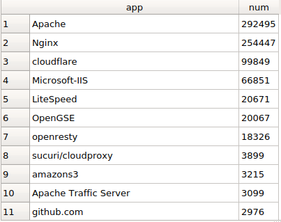

# Web Server Market share
---
## A. Mô tả:
### 1. Gửi GET request đến các url trong list top-1m.csv. Phân tách HTTP response để lấy thông tin web-server
### 2. Sử dụng 50 spider để cải thiện tốc độ

## B. Vấn đề:
### 1. Một số website trong list không truy cập được (ví dụ: microsoftonline.com)
### 2. Một số HTTP response không có thông tin về web-server

## C. Kết quả:
### 1. thu được thông tin web-server từ 827,299/1,000,000 websites
### 2. Top 10:

