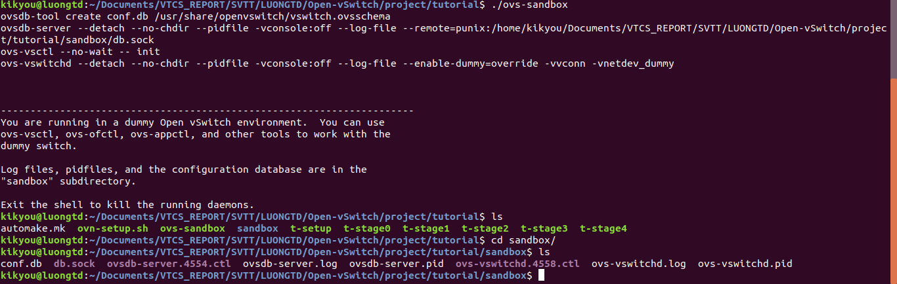
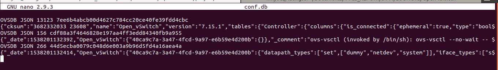
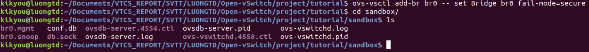
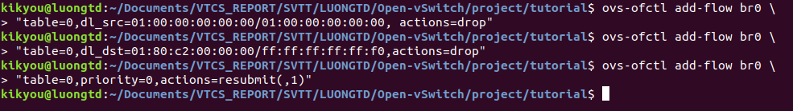
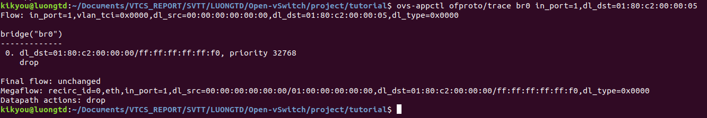
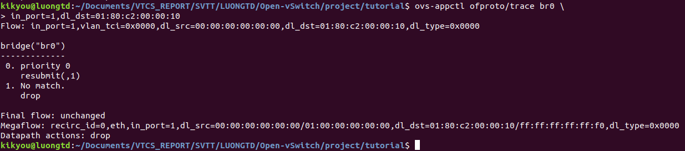
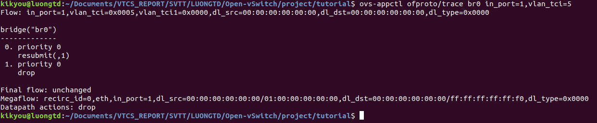
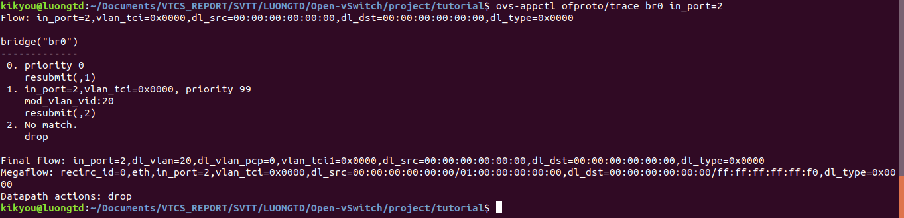
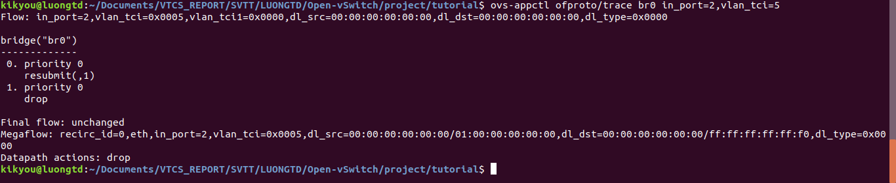

# OVS labs
## [1. Pipeline Testing](#pipeline)
## [2. VLAN Testing](#vlan)
---
## <a name="pipeline"></a> 1. Pipeline Testing
### 1.1. Khởi động Sandbox
- Chuyển vào thư mục tutorial của project Open vSwitch: ```cd /tutorial```
- Thực thi script ```ovs-sandbox```: ```./ovs-sandbox```. Script này sẽ thực hiện những thao tác sau:
	- Thư mục ```sandbox``` do phiên làm việc cũ sẽ bị xóa, đồng thời thư mục ```sandbox``` mới được tạo ra
	- Cài đặt biến môi trường đặc biệt, đảm bảo Open vSwitch sẽ nhìn vào thư mục sandbox và làm việc thay vì thư mục cài đặt Open vSwitch
	- Tạo cơ sở dữ liệu cấu hình trong thư mục ```sandbox```
	- Khởi động ```ovsdb-server``` trong thư mục ```sandbox```
	- Khởi động ```ovs-vswitchd``` trong thư mục ```sandbox```
	- Khởi động trình shell trong thư mục ```sandbox```





- Dưới góc nhìn của OVS thì các bridge tạo ra trên môi trường sandbox tương tự như bridge thường, nhưng network stack của hệ điều hành chủ không thể nhìn thấy được các bridge này nên không thể sử dụng các lệnh thông thường như ```ip``` hay ```tcpdump```\

### 1.2. Kịch bản
- Lab này tạo nên các Open vSwitch flow table để phục vụ các tính năng VLAN, MAC learning của switch với 4 port:
	- p1: trunk port cho phép gói tin từ mọi VLAN, tương ứng với Open Flow port1
	- p2: access port cho VLAN 20, tương ứng OpenFlow port 20
	- p3, p4: cả hai port này đều phục vụ VLAN 30, tương ứng với Open Flow port 3 và port 4
- Tạo switch bao gồm 4 bảng chính, mỗi bảng sẽ triển khai một stage trong pipeline của switch:
	- Table 0: Admission control - Cho phép kiểm soát các gói tin đầu vào ở mức cơ bản
	- Table 1: Xử lý VLAN đầu vào
	- Table 2: học MAC và VLAN đối với ingress port
	- Table 3: tìm kiếm port đã học nhằm xác định port đầu ra của gói tin
	- Table 4: xử lý đầu ra

### 1.3. Cài đặt
- Tạo bridge ```br0``` ở ```fail-secure``` mode để Open Flow table rỗng khi khởi tạo, nếu không Open Flow table sẽ khởi tạo một flow thực thi ```normal``` action.
```sh
ovs-vsctl add-br br0 -- set Bridge br0 fail-mode=secure
```




- Tạo các port p1, p2, p3, p4 với tùy chọn ```ofport-request``` để đảm bảo **port p1** gán cho **Open Flow port1**, **port p2** được gán cho **OpenFlow port2** và tương tự như vậy...
```sh
for i in 1 2 3 4; do
	ovs-vsctl add-port br0 p$i -- set Interface p$i ofport_request=$i
	ovs-ofctl mod-port br0 p$i up
done
```


### 1.4. Triển khai Table 0: Admission Control
- Table 0 là bảng đầu tiên gói tin đi qua đầu tiên, được sử dụng để bỏ qua các gói tin vì một số lý do nào đó hoặc gói tin không hợp lệ. Trong trường hợp này, các gói tin với địa chỉ nguồn multicast được coi là không hợp lệ và do đó ta thêm flow để hủy chúng:
```sh
ovs-ofctl add-flow br0 \ 
"table=0, dl_src=01:00:00:00:00:00/01:00:00:00:00:00, actions=drop"
```
- Switch br0 ở đây cũng không chuyển tiếp gói tin STP chuẩn IEEE 802.1D hoặc địa chỉ MAC đích là địa chỉ reversed multicast.
```sh
ovs-ofctl add-flow br0 \
"table=0, dl_dst=01:80:c2:00:00:00/ff:ff:ff:ff:ff:f0, actions=drop"
```
- Với các gói tin khác ta coi là hợp lệ thì chuyển (resubmit) gói tin sang bước tiếp theo trên **Open Flow table 1**:
```sh
ovs-ofctl add-flow br0 "table=0, priority=0, actions=resubmit(,1)"
```


### Testing Table 0
Nếu ta sử dụng Open vSwitch để thiết lập (set up) một switch vật lý hoặc switch ảo, ta có thể test bằng cách gửi gói tin thông qua nó bằng các công cụ kiểm tra mạng phổ biến như **ping** và **tcpdump** hoặc các công cụ chuyên biệt khác như Scapy. Trong bài lab này, switch của ta không "hiển thị" với hệ điều hành nên ta phải dùng công cụ **ofproto/trace**. **ofproto/trace** chỉ ra từng bước một cách một flow đi qua switch. 
**Ví dụ 1** 
test command ```ovs-appctl ofproto/trace br0 in_port=1,dl_dst=01:80:c2:00:00:05```:



Dòng đầu tiên của kết quả cho biết *flow* đang duyệt. Nhóm các dòng tiếp theo cho biết hành trình của gói tin qua bridge br0. OpenFlow **flow table 0** thấy địa chỉ đích là địa chỉ reversed multicast và khớp với flow đã thiết lập nên hủy bỏ gói tin.
**Ví dụ 2** 
test command ```ovs-appctl ofproto/trace br0 in_port=1,dl_dst=01:80:c2:00:00:10```:


Lần này, flow xử lý bởi ```ofproto/trace``` không khớp với bất kì "drop flow" nào trong **table 0** và nó chuyển qua flow có độ ưu tiên thấp hơn là "resubmit" để đưa gói tin sang **table 1** xử lý ở chặng tiếp theo. Vì ta chưa thêm bất cứ flow nào vào **OpenFlow table 1**, nên không có matching flow nào xảy ra trong lần lookup thứ 2 này. Gói tin cuối cùng cũng bị drop.

### Triển khai Table 1: VLAN input processing
- Gói tin sau khi đã vượt qua bước xác thực cơ bản ở **table 0** sẽ đi vào **table 1** để chứng thực VLAN của gói tin dựa trên cấu hình VLAN của port mà gói tin đi qua. Nếu gói tin đi vào acccess port mà chưa có VLAN header chỉ định thuộc VLAN nào thì nó sẽ được chèn thêm VLAN header để xử lý tiếp.
- Đầu tiên, thực hiện thêm flow mặc định với mức độ ưu tiên thấp để hủy bỏ mọi gói tin không khớp flow nào khác:
```sh
ovs-ofctl add-flow br0 "table=1, priority=0, actions=drop"
```
- Tiếp đó, gửi mọi gói tin đi vào **port 1** sang **table 2**:
```sh
ovs-ofctl add-flow br0 "table=1, in_port=1, actions=resubmit(,2)"
```
- Trên các access port khác, gói tin đi tới mà không có VLAN header sẽ được gắn VLAN number tương ứng với access port, sau đó được chuyển tới bảng tiếp theo:
```sh
ovs-ofctl add-flows br0 - <<'EOF'
table=1, priority=99, in_port=2, vlan_tci=0, actions=mod_vlan_vid:20, resubmit(,2)
table=1, priority=99, in_port=3, vlan_tci=0, actions=mod_vlan_vid:30, resubmit(,2)
table=1, priority=99, in_port=4, vlan_tci=0, actions=mod_vlan_vid:30, resubmit(,2)
EOF
```

**Testing table 1**
**ofprot/trace** cho phép ta kiểm tra các VLAN flows mà ta vừa thêm vào.
**Ví dụ 1: Packet on Trunk port (p1)**
- Kiểm thử gói tin trên trunk port (p1):
```sh
ovs-appctl ofproto/trace br0 in_port=1,vlan_tci=5
```
Kết quả đầu ra cho thấy, hành vi tìm kiếm (lookup) trên **table 0**, sau đó resubmit sang **table 1**, rồi resubmit tiếp tới **table 2**

 

**Ví dụ 2: Valid Packet on Access Port**
command kiểm thử gói tin hợp lệ trên Access Port: 
```sh
ovs-appctl ofproto/trace br0 in_port=2
```
Ở đây, gói tin đi vào port 2 mà không có VLAN header nên sẽ được chèn thêm VLAN header tương ứng của **port 2** với VLAN ID là 20.
 

**Invalid Packet on Access Port**
command kiểm thử gói tin không hợp lệ trên Access Port:
```sh
ovs-appctl ofproto/trace br0 in_port=2,vlan_tci=5
```
Gói tin ở đây với ```Tag Control Information``` là 5 đi vào **port 2** tương ứng VLAN 20 sẽ bị hủy:




## <a name="vlan"></a> 2. VLAN Testing
