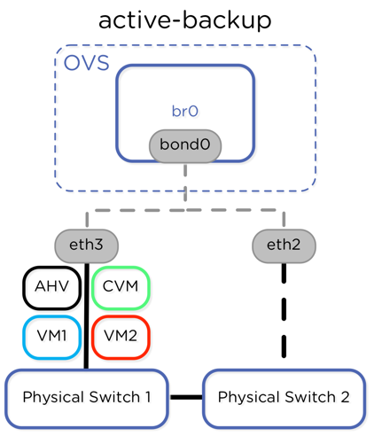
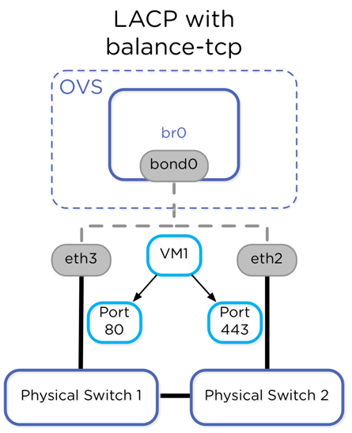
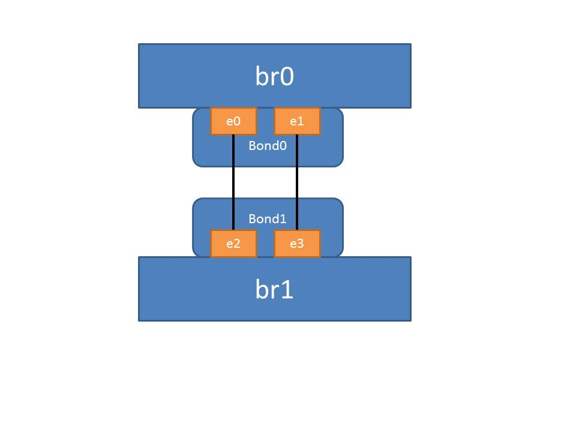
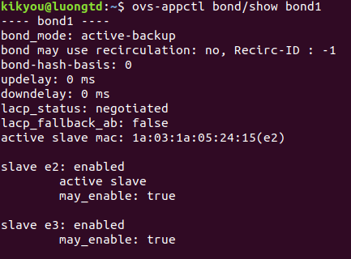
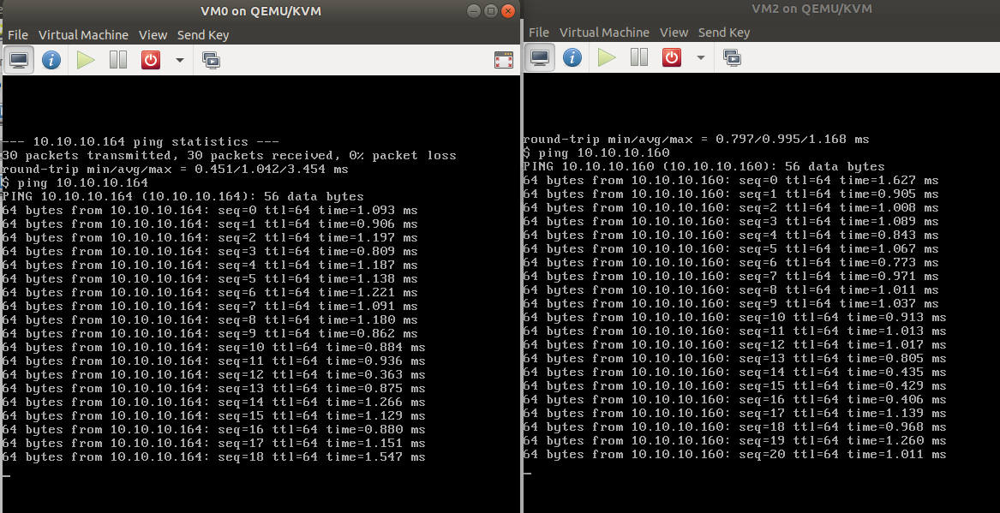
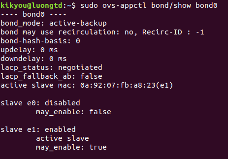
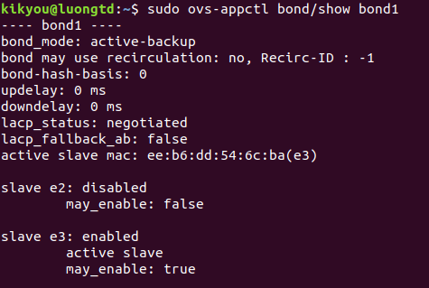

# OVS LABS (cont)
## [0. Bổ túc kiến thức network](#botuc)
## [1. OpenvSwitch với Mininet](#tongquan)
### [1.1. Một số topo cơ bản](#basic)
### [1.2. Kiểm tra Flow Table](#flowtb)
## [2. Bonding với OpenvSwitch](#bonding)
### [2.0. Khái niệm bonding](#bond-def)
### [2.1. Kịch bản lab](#bond-topo)
### [2.2. Cấu hình](#bond-configure)
---
## <a name="tongquan"></a> 1. OVS với Mininet
Mininet là phần mềm giả lập mạng cho phép tạo switch, host và kết nối giữa chúng để phục vụ mục đích kiểm thử.

### Cài đặt Mininet
#### Clone source code:
```sh
git clone git://github.com/mininet/mininet
```

#### Install:
```sh
mininet/util/install.sh [options]
```
Các options cụ thể như sau:
- ```a```: cài đặt mọi thứ được chứa trong máy ảo Mininet, gồm cả các phụ thuộc (dependencies) như Open vSwitch cũng như các phần bổ sung như trình giải mã (dissector) OpenFlow Wireshark và POX. (Mặc định, các công cụ này sẽ được build trong các thư mục được tạo trong thư mục chính của bạn.)
- ```nfv```: cài đặt Mininet, OpenFlow reference switch và Open vSwitch 

#### Tạo một topology mặc định với command ```sudo mn```


#### Mininet cho phép sử dụng một số command từ trình shell mặc định của Linux. Để thực hiện điều đó, thêm ```sh``` vào trước mỗi lệnh trên trình shell của mininet


#### Kiểm tra cấu hình các OVS bridge sau khi có được topo mặc định ( 2 host và 1 switch)


#### Kiểm tra topo mặc định
- Kiểm tra các node, ở đây topo mặc định sẽ bao gồm hai host **h1**, **h2**, một switch **s1** kết nối với hai host và kết nối với controller **c0**.


- Kiểm tra chi tiết hết về mỗi thành phần trong topo. Sử dụng command ```dump```


- Kiểm tra kết nối giữa các node. Sử dụng command ```net```


- Ping thử giữa hai host


- Thử command trên một host


- Kiểm tra kết nối giữa toàn bộ các hót. Sử dụng command ```pingall```


- Thoát khỏi mininet


- Xóa bỏ toàn bộ các zombie process liên quan đến các thao tác với mininet ở trên


### <a name="basic"></a> 1.1. Một số topo cơ bản
#### 1.1.1. Tạo topo với 4 host và 1 switch
- Tạo topo: ```sudo mn --topo=single,4```


- Kiểm tra trạng thái của OVS bridge: ```sh ovs-vsctl show``` 


- Kiểm tra số lượng node: command ```nodes```, kiểm tra liên kết giữa các node: ```net```


#### 1.1.2. Tạo topo tuyến tính với 4 nodes
- Tạo topo: ```sudo mn --topo=linear,4```


- Kiểm tra trạng thái của OVS bridge: ```sh ovs-vsctl show```

```sh 
mininet> sh ovs-vsctl show
42af9da6-8f90-4895-b686-52a37c917e4e
    Bridge "s4"
        Controller "ptcp:6657"
        Controller "tcp:127.0.0.1:6653"
            is_connected: true
        fail_mode: secure
        Port "s4-eth2"
            Interface "s4-eth2"
        Port "s4-eth1"
            Interface "s4-eth1"
        Port "s4"
            Interface "s4"
                type: internal
    Bridge "s3"
        Controller "ptcp:6656"
        Controller "tcp:127.0.0.1:6653"
            is_connected: true
        fail_mode: secure
        Port "s3-eth3"
            Interface "s3-eth3"
        Port "s3-eth1"
            Interface "s3-eth1"
        Port "s3"
            Interface "s3"
                type: internal
        Port "s3-eth2"
            Interface "s3-eth2"
    Bridge "s2"
        Controller "ptcp:6655"
        Controller "tcp:127.0.0.1:6653"
            is_connected: true
        fail_mode: secure
        Port "s2-eth3"
            Interface "s2-eth3"
        Port "s2"
            Interface "s2"
                type: internal
        Port "s2-eth2"
            Interface "s2-eth2"
        Port "s2-eth1"
            Interface "s2-eth1"
    Bridge "s1"
        Controller "ptcp:6654"
        Controller "tcp:127.0.0.1:6653"
            is_connected: true
        fail_mode: secure
        Port "s1-eth1"
            Interface "s1-eth1"
        Port "s1"
            Interface "s1"
                type: internal
        Port "s1-eth2"
            Interface "s1-eth2"
    ovs_version: "2.9.2"
```

- Kiểm tra liên kết giữa các nodes: ```links```


- Topo tuyến tính sẽ có dạng như sau:
```sh

                   h2     h3
                   +       +
                   |       |
                   +       +
     h1-----s1-----s2-----s3-----s4-----h4
            +      +       +      +
            |      |       |      |
            |      +-------+      |
            +-------+ c0 +--------+
                    +----+

```

#### 1.1.3. Tạo topo dạng tree với 4 host và 3 switch

- Tạo topo với command ```sudo mn -topo=tree,2,2```


- Kiểm tra status của OVS

```sh
mininet> sh ovs-vsctl show
42af9da6-8f90-4895-b686-52a37c917e4e
    Bridge "s1"
        Controller "tcp:127.0.0.1:6653"
            is_connected: true
        Controller "ptcp:6654"
        fail_mode: secure
        Port "s1"
            Interface "s1"
                type: internal
        Port "s1-eth2"
            Interface "s1-eth2"
        Port "s1-eth1"
            Interface "s1-eth1"
    Bridge "s2"
        Controller "tcp:127.0.0.1:6653"
            is_connected: true
        Controller "ptcp:6655"
        fail_mode: secure
        Port "s2-eth2"
            Interface "s2-eth2"
        Port "s2"
            Interface "s2"
                type: internal
        Port "s2-eth1"
            Interface "s2-eth1"
        Port "s2-eth3"
            Interface "s2-eth3"
    Bridge "s3"
        Controller "ptcp:6656"
        Controller "tcp:127.0.0.1:6653"
            is_connected: true
        fail_mode: secure
        Port "s3"
            Interface "s3"
                type: internal
        Port "s3-eth3"
            Interface "s3-eth3"
        Port "s3-eth2"
            Interface "s3-eth2"
        Port "s3-eth1"
            Interface "s3-eth1"
    ovs_version: "2.9.2"
```

- Kiểm tra số node, thông tin IP và kết nối của chúng


- Topo dạng tree sẽ có dạng như sau

```sh
                        s1
                         +
h1+---------+            |          +----------+h4
            |            |          |
            |            |          |
            +            |          +
h2+--------+s2           |         s3+----------+h3
             +--------+  |  +-------+
                      +--+--+
                      | c0  |
                      +-----+

```

### <a name="flowtb"></a> 1.2. Kiểm tra Flow Table
#### Tạo topo gồm 4 host nối vào 1 switch, sử dụng tùy chọn ```--mac``` để giữ địa chỉ MAC cho các host


#### Thực hiện dump cấu hình của các port trên OVS bridge. Các host kết nối với các port riêng biệt của switch.
Command ```sh ovs-ofctl dump-ports-desc s1``` cho phép match số hiệu port với tên port. (Trong các flow table, ta chỉ thấy được số hiệu port, do đó command này sẽ hữu ích để tiện theo dõi hơn)


- Kiểm tra thông tin thống kê của mỗi port. Sử dụng command: ```sh ovs-ofctl dump-ports s1```


- In ra flow table do **ovs-vswitchd** quản lý: ```sh ovs-ofctl dump-flows s1```

```sh
mininet> sh ovs-ofctl dump-flows s1
mininet> 
```

Chưa có entry nào do chưa có bất kì kết nối nào giữa các host.

Thử kiểm tra controller điều khiển vswitch **s1**: ```sh ovs-vsctl get-controller s1```


#### Tạo traffic đơn giản bằng cách ping giữa host **h1** và **h2**: ```h1 ping -c5 h2```


Ta thấy rằng, gói tin đầu tiên có RTT (Round Trip Time) lâu hơn do đó là gói tin đầu tiên của flow mới từ **host 1** gửi tới switch **s1**, switch chưa xử lý được nên sẽ gửi lên controller xử lý rồi mới gửi lại switch để chuyển tiếp sang **host 2**. Những gói tin tiếp theo do cùng flow nên thực hiện **flow matching** thành công ngay tại switch và chuyển trực tiếp sang **host 2** mà không cần lên hỏi controller nên RTT sẽ ngắn hơn.

- Thử dump-flow table lại: ```sh ovs-ofctl dump-flows s1```


Ta thấy, ARP rule đã được đưa thêm vào flow table. Output port là các port mà gói tin sẽ được forward ở đầu ra của pipeline trên switch. Số hiệu port tương ứng với các port dump ở command ```sh ovs-ofctl dump-ports-desc s1```.

#### Xóa các flow entry hiện tại trên flow table của switch


#### Sử dụng Wireshark để bắt gói tin ping từ h1 sang h2
- Khởi động Wireshark trên trình shell chính của Linux, lắng nghe trên cổng loopback.
Command: ```sudo wireshark```

- ping từ **h1** sang **h2** trên shell của mininet: ```h1 ping -c5 h2```


#### Dump flow table của switch


#### Quan sát các gói tin wireshark đã bắt được


Ta thấy các frame 316, 320, 331, 334, 337, 341 là các bản tin tương ứng hành động add-flow của controller để tạo ra 6 flow entry như kết quả dump-flow table ở trên.

- Mở frame 316 - là frame đã add entry đầu tiên vào switch.


#### Đợi sau hơn 60s ping lại từ h1 sang h2

- Thời gian reply đầu tiên (một lần nữa) mất nhiều thời gian hơn bởi vì gói tin đã đi theo đường (h1–> s1–> c1–> s1–> h2) giống như đã trình bày ở trên.
- Giá trị ```Idle time-out``` (60s), cho biết thời gian bao lâu kể từ khi bắt được gói tin thì flow sẽ bị inactive. Vì vậy, khi ta ping lại giữa hai host sau 60s thì flow phải được thiết lập lại.
- Thử ping lại ngay sau thao tác ping trên:


Thời gian reply đầu tiên không quá lâu như lần ping trước đó vì flow trên vẫn còn "hiệu lực".

## <a name="bonding"></a> 2. Bonding trong OpenvSwitch
### <a name="bond-def"></a> 2.0. Sơ lược về bonding
Bonding hay còn gọi là **port forwarding** hoặc **link aggregation** là việc kết hợp nhiều NIC thành một NIC logic duy nhất nhằm cân bằng tải, tăng thông lượng, tăng khả năng chịu lỗi (fault tolerance) của hệ thống.
- Bonding cho phép hai hay nhiều interface (còn gọi là "slave" khi thực hiện cấu hình bonding) chia sẻ lưu lượng mạng. Ở góc nhìn mức cao, các interface được liên kết với nhau thành một port logic duy nhất nhưng chúng có băng thông tổng cộng của nhiều thiết bị.
	- Ví dụ: 2 card mạng vật lý 1Gbps khi được bond với nhau được xem như một card với tốc độ 2Gbps.
- Cấu hình bond cũng đem lại khả năng dự phòng, bond port sẽ không bị down chừng nào vẫn còn slave đang "sống".
- Có nhiều chế độ thực hiện bonding nhưng openvswitch chỉ triển khai ba chế độ: **active-backup**, **balance-slb**, **balance-tcp**.

### Active-Backup
Là bond mode đơn giản nhất, dễ dàng cho phép kết nối với nhiều upstream switch mà không cần cấu hình thêm cho switch. Nhược điểm là traffic từ các VMs chỉ sử dụng duy nhất một active link trong bond. Tất cả các backup link không được sử dụng. Trong một hệ thống với dual 10 gigabit Ethernet adapter, thông lượng lớn nhất của tất cả các VMs chạy trên một node là 10Gbps.



Active-backup là bond mode mặc định. 

### Balance-slb
Balance-slb bond mode trong OVS sử dụng tất cả các links trong một bond và áp dụng đo lưu lượng (measured trafic load) để tái cân bằng traffic từ interface được sử dụng nhiều sang bớt interface khác. Khi thời gian bond-rebalance kết thúc, OVS sử dụng lưu lượng đã được đo (measured load) cho mỗi source MAC hash để mở rộng traffic giữa các links trong bond.

Lưu lượng (traffic) từ MAC source hash (MAC nguồn đã băm) có thể được chuyển tới liên kết ít active hơn để cân bằng hơn trong việc sử dụng các liên kết thành viên trong bond. Mỗi card mạng của máy ảo sử dụng duy nhất một slave interface trong đường bond, tuy nhiên lưu lượng từ nhiều máy ảo (xử lý với nhiều địa chỉ MAC nguồn) được phân tán trên các interface thành viên của đường bond tùy theo thuật toán băm. Như vậy, một node có 2 interface tốc độ 10Gbps, tổng thông lượng mà các VMs có thể sử dụng sẽ tăng lên 20Gbps, trong khi mỗi VM có thể sử dụng thông lượng tối đa là 10Gbps.s


### Balance-tcp
Để có thể tận dụng được hoàn toàn lợi thế về băng thông được cung cấp khi sử dụng nhiều liên kết với các switch từ các máy ảo đơn lẻ, OVS buộc phải cấu hình sử dụng LACP (Link Aggregation Control Protocol) và balance-tcp. Tuy nhiên, trong cấu hình này, LACP và balance-tcp yêu cầu phải cấu hình switch. Với LACP, nhiều liên kết tách biệt trên các switch vật lý được đối xử như một liên kết layer-2 duy nhất. Lưu lượng có thể bị chia ra nhiều liên kết trong mô hình active-active dựa trên thuật toán băm lưu lượng (traffic hashing). Lưu lượng có thể được cân bằng giữa các thành viên của liên kết bond mà không liên quan gì tới bảng MAC trên switch, bởi vì các uplink được xem như một liên kết layer-2 duy nhất. 
Cấu hình balnace-tcp kết hợp LACP được khuyên dùng vì nhiều luồng dữ liệu từ Layer 4 (transport) từ một VM có thể sử dụng được băng thông của tất cả các uplink (các liên kết thành viên của bond). Do đó, nếu như một máy có 2 card 10Gbps khi cấu hình bonding chế độ balance-tcp kết hợp với LACP, các TCP stream từ một máy ảo trên đó có thể sử dụng băng thông tối đa là 20Gbps thay vì chỉ là 10Gbps khi cấu hình balance-slb.



### <a name="bond-topo"></a> 2.1. Kịch bản lab
- Kiểm tra tính năng link Aggregation và LACP với OVS theo mô hình sau:
	- Dùng OVS tạo hai switch ảo **br0**, **br1** và tạo 2 port trên mỗi switch.
	- Tiến hành nối các port giữa các switch thành 2 đường dự phòng hỗ trợ nhau như hình minh họa. Tiến hành bond 2 port trên mỗi switch. Để kiểm tra tính dự phòng, tạo 2 máy ảo, mỗi máy ảo cắm vào một switch ảo như trên. Tiến hành ping giữa hai máy, kiểm tra kết nối khi ta ngắt một trong hai đường kết nối.



### <a name="bond-configure"></a> 2.2. Cấu hình LACP với OpenvSwitch
#### Trước hết, ta thực hiện cấu hình 2 switch ảo **br0** và **br1** với các port internal nối giữa 2 switch 	như topo.
- Tạo 2 bridge **br0** và **br1**
```sh
ovs-vsctl add-br br0
ovs-vsctl add-br br1
```
- Tạo các bond interface trên các bridge **br0** và **br1**, kích hoạt sẵn giao thức lacp
```sh
ovs-vsctl add-bond br0 bond0 e0 e1 lacp=active
ovs-vsctl add-bond br1 bond1 e2 e3 lacp=active
```
- Tạo các liên kết internal giữa hai bridge (**e0-e2**, **e1-e3**)
```sh
ovs-vsctl set interface e0 type=patch options:peer=e2
ovs-vsctl set interface e2 type=patch options:peer=e0
ovs-vsctl set interface e1 type=patch options:peer=e3
ovs-vsctl set interface e3 type=patch options:peer=e1
```
- Kiểm tra lại cấu hình bonding
```sh
ovs-appctl bond/show bond0
ovs-appctl bond/show bond1
```




Ta thấy, liên kết **active** đang là **e0-e2**.

#### Tạo các máy ảo gắn vào 2 bridge br0 và br1
Trong mô hình này, ta sử dụng 2 máy ảo:
- VM0: gán vào bridge **br0**, thiết lập địa chỉ IP tĩnh: 10.10.10.160/24
- VM2: gán vào bridge **br1**, thiết lập địa chỉ IP tĩnh: 10.10.10.164/24

Ban đầu ta thực hiện ping giữa hai máy ảo **VM0** và **VM2** kết quả ping có phản hồi bình thường



Tiếp đó, vẫn giữ trạng thái ping giữa hai máy ảo, đồng thời chỉnh sửa cấu hình sai, mục đích là cố ý gây ra sự cố trên đường link internal đang active (**e0-e2**). Ta sẽ cấu hình peer **e0** với interface **br1** trên bridge **br1**.

```sh
sudo ovs-vsctl set interface e0 type=patch options=peer:br1
```

Sau một khoảng thời gian sau khi thực hiện cấu hình ngắt kết nối **e0-e2**, hiện tượng mất kết nối giữa hai máy xảy ra. Tuy nhiên, do cấu hình bonding **active-backup** kết hợp với lacp, liên kết **e1-e3** được kích hoạt thay thế cho kết nối đã mất, cho phép thiết lập lại kết nối giữa hai máy ảo.





