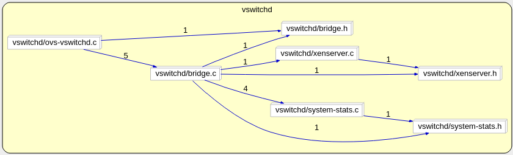

# ovs-vswitchd

---
## 1. Kiến trúc
### 1.1. Phân tích hàm main trong file vswitchd/ovs-vswitchd.c:

```c
int main()
{
    /* step.1. khởi tạo bridge module, được thực hiện trong vswitchd/bridge.c
    Module bridge sẽ lấy một số tham số cấu hình từ ovsdb */
    bridge_init();

    /* step.2. deamon loop */
    while (!exiting) {
        /* step.2.1. Xử lý control messages từ OpenFlow Controller và CLI */
        bridge_run()
          |
          |--dpdk_init()
          |--bridge_init_ofproto() 			// khởi tạo bridge
          |--bridge_run__()
              |
              |--for(datapath types):		/* Mỗi datapath sẽ thực hiện công việc của mình bằng cách chạy ofproto_type_run(), 
              								vswitchd sẽ gọi vào kiểu thực thi type_run() cụ thể của kiểu dữ liệu đó. */
                     ofproto_type_run(type)

              |--for(all_bridges):			/* Mỗi bridge sẽ thực hiện công việc của nó bằng cách chạy ofproto_run()
              								vswitchd sẽ gọi vào hàm run() cụ thể của class ofproto.*/
                     ofproto_run(bridge) 	// xử lý message từ OpenFlow Controller

        unixctl_server_run(unixctl); 		/* Nhận control message từ CLI (ovs-appctl <xxx>) */

        netdev_run(); 						/* Performs periodic work needed by all the various kinds of netdevs
											Xử lý các loại netdev khác nhau 
											*/

        /* step.2.2. đợi cho events đến */
        bridge_wait();
        unixctl_server_wait(unixctl);
        netdev_wait();

        /* step.2.3. block cho đến khi events đến */
        poll_block();
    }
}
```

### 1.2. Sử dụng Scitools Understand vẽ Dependancy Graph của vswitchd:

