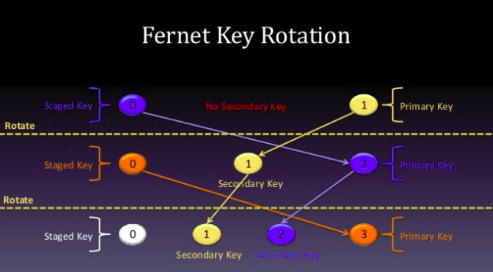
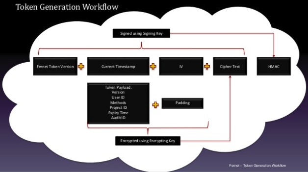
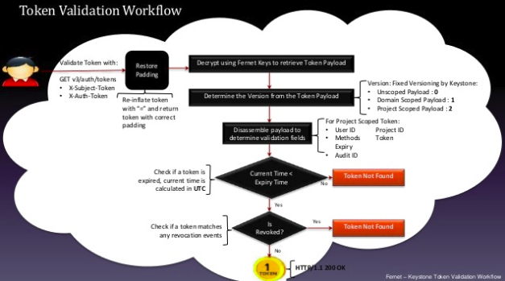
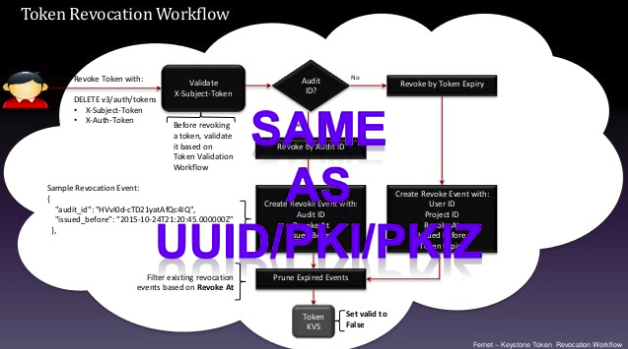
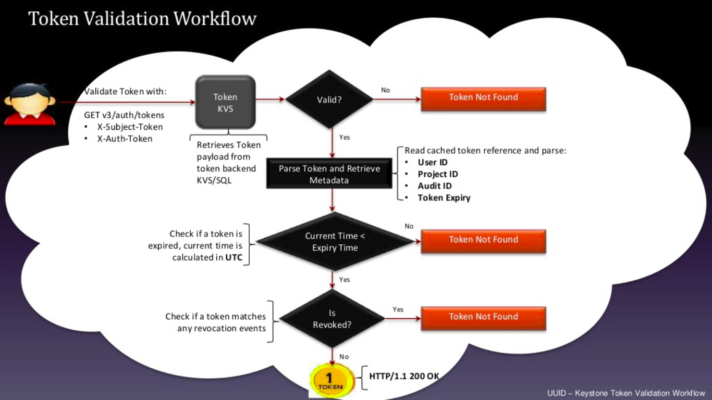
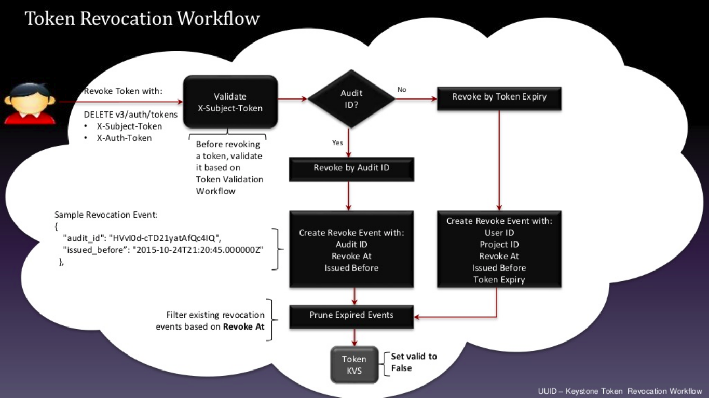
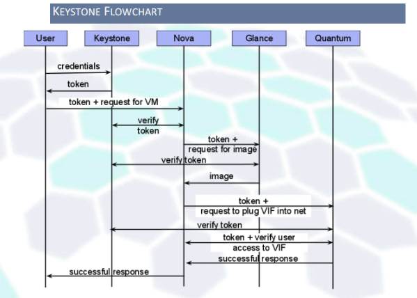
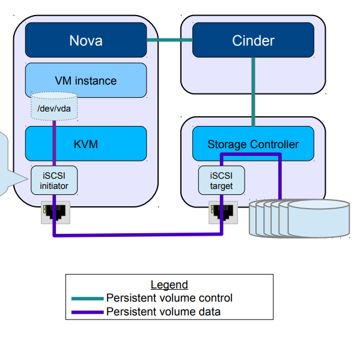
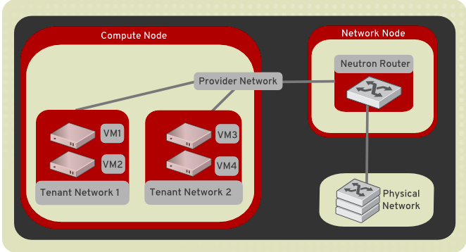
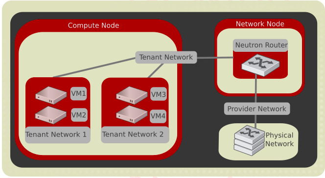

# OpenStack Basic
## Cloud Overview
### What is the Cloud?
- Cloud là thuật ngữ đề cập việc truy cập máy tính, công nghệ thông tin và ứng dụng phần mềm thông qua kết nối mang, thường truy cập các data center sử dụng mạng diện rộng WAN hoặc kết nối Internet.
- Hầu hết các tài nguyên IT có thể chạy ổn định trên cloud: một phần mềm hay ứng dụng, service hoặc toàn bộ cơ sở hạ tầng. Ví dụ, nếu một doanh nghiệp muốn xây dựng hạ tâng IT, nói chung sẽ cài đặt server, phần mềm, tài nguyên mạng nhưng các dịch vụ và tài nguyên đó đều có thể truy cập bởi bên thứ ba cung cấp chúng trên cloud.
### Type of Cloud
Cloud được chia làm 3 loại: public, private và hybrid dựa trên người có thể truy cập đến dịch vụ hoặc cơ sở hạ tầng: 
- Public-cloud: cho phép mọi người muốn mua hay thuê dịch vụ, không giới hạn là khách hàng cá nhân hoặc công ty lớn.
- Private-cloud: cho một khách hàng duy nhất (một doanh nghiệp, phòng ban) đảm bảo vấn đề bảo mật, độc lập về tài nguyên, tiết kiệm chi phí phần cứng và tối ưu trong việc quản trị hệ thống.
- Hybrid-cloud: sự kết hợp của private cloud và public cloud, ta có thể lựa chọn các môi trường khác nhau (private hoặc public) để thực hiện các workload (một hoặc nhiều ứng dụng) sao cho việc lựa chọn môi trường là phù hợp nhất với các ứng dụng đó.

## OpenStack 
### Overview
- OpenStack là một nền tảng điện toán đám mây mã nguồn mở cung cấp tất cả các môi trường cloud. OpenStack nhắm tới việc triển khai đơn giản, khả năng mở rộng lớn và có nhiều tính năng. OpenStack được các chuyên gia cloud computing trên toàn cầu tham gia xây dựng
- OpenStack cung cấp giải pháp Infrastructure-as-a-Service (IaaS) qua nhiều dịch vụ bổ sung. Mỗi dịch vụ cung cấp một giao diện lập trình ứng dụng (API) tạo điều kiện cho sự tích hợp này
  - IaaS là một mô hình cung cấp trong đó một tổ chức thuê các thành phần vật lý của dữ liệu trung tâm, như lưu trữ, phần cứng, các máy chủ và các thành phần mạng. Một dịch vụ câng cấp sở hữu trang thiết bị và chịu trách nhiệm cho việc lưu trữ, vận hành và bảo trì nó. Khách hàng thường trả phí theo mỗi người dùng cơ bản. IaaS là một mô hình cung cấp các dịch vụ đám mây.
  - API : một tập hợp các chỉ định được sử dụng để truy cập một dịch vụ, ứng dụng hay chương trình. Bao gồm các lệnh gọi dịch vụ, tham số yêu cầu cho mỗi lệnh gọi và các tham số trả về mong muốn
#### Coreservice 
- Identity service (keystone)
	- cung cấp điểm tích hợp quản lý xác thực, cấp quyền và danh sách các dịch vụ
	- là service đầu tiên người dùng sẽ tương tác, sau khi xác thực end-user có thể sử dụng định danh của họ để truy cập dịch vụ khác của OpenStack
	- các service của OpenStack sử dụng keystone để xác thực người dùng
	- users và services có thể định vị các dịch vụ khác bằng cách sử dụng service catalog được quản lý bởi Identity service. 
	- các component:
		- Server: một server trung tâm cung cấp dịch vụ cấp quyền và xác thực sử dụng RESTful interface
		- Drivers: driver hoặc một dịch vụ hệ thống tương tác với server trung tâm, sử dụng để truy cập thông tin định danh trong kho lưu trữ bên ngoài có thể tồn tại trong hạ tầng nơi OpenStack đã được triển khai
		- Modules: middleware modules chạy trong không gian địa chỉ của OpenStack component đang sử dụng Identity service. Các module này chặn yêu cầu dịch vụ, trích xuất thông tin xác thực người dùng gửi chúng tới server trung tâm để được cấp quyền. Sự tương tác giữa middleware modules và các component OpenStack sử dụng Python Web Server Gateway Interface.
- Image service (glance)
	- cho phép người dùng discover, register và retrieve virtual machine image
	- đáp ứng REST API cho phép người dùng truy vấn VM image metadata và phục hồi các image
	- có thể lưu trữ VM image được tạo bởi Image service tại nhiều vị trí file system, OpenStack Object Storage 
	- là trung tâm của kiến trúc IaaS, cho phép API request tới disk hoặc server image và định nghĩa metadata từ end user hoặc OpenStack Compute components.
	- các component:
		- glance-api: chấp nhận Image API gọi để discovery, retrieval và storage
		- glance-registry: lưu trữ, xử lý và phục hồi metadata của image 
		- Database: lưu trữ image metadata
		- Storage repository for image files: nhiều dạng repository được chấp nhận: normal file system, Object Storage, RADOS block devices, VMware datastore và HTTP
		- Metadata definition service: API chung cho vendor, admin, service và user để cấu hình sở hữ custom metadata.
- Compute service (nova)
	- sử dụng để lưu trữ và quản lý hệ thống cloud
	- tương tác với OpenStack Identity để xác thực, OpenStack Image cho disk và server image và với OpenStack Dashboard để cung cấp giao diện người dùng và admin.
	- các component:
		- nova-api service: chấp nhận và phản hồi end user các API call, hỗ trợ OpenStack Compute API, Amazon EC2 API và admin API đặc biệt cho user đặc quyền quản trị. Nó thực thi một số policy và khởi tạo các hoạt động orchestration như chạy một instance.
		- nova-api-metadata service: chấp nhận yêu cầu metadata từ instance, thường được sử dụng khi bạn chạy trên nhiều host với cài đặt nova-network 
		- nova-compute service: một worker daemon tạo và chấm dứt VM instance thông qua hypervisor API.
		- nova-placement-api service: theo dõi inventory và usage của mỗi provider
		- nova-scheduler service: nhận yêu cầu của VM instance từ queue và xác định compute server host sẽ thực hiện yêu cầu đó
		- nova-conductor module: tương tác trung gian giữa nova-compute service và database. Nó không cho phép truy cập trực tiếp đến cloud database từ nova-compute service. Nova-conductor module mở rộng theo chiều ngang, tuy nhiên nó không triển khai được trên node mà nova-compute service chạy.
		- nova-consoleauth daemon: cấp phép cho người dùng giao diện điều khiển proxy
		- nova-novncproxy daemon: cung cấp một proxy cho truy cập chạy instance thông qua kết nối VNC
		- nova-spicehtml5proxy daemon: cung cấp proxy cho truy cập chạy instance qua kết nối SPICE, hỗ trợ khách hàng HTML5 dựa trên browser
		- nova-xvpvncproxy daemon: cung cấp proxy cho truy cập chạy instance thông qua kết nối VNC
		- The queue: hub trung tâm truyền thông điệp giữa các daemon. Thường xuyên thực hiện với RabbitMQ, cũng hỗ trợ với AMQP message queue 
		- SQL database: lưu trữ hầu hết các trạng thái build-time và run-time của cloud infrastructure 
- Networking service (neutron)
	- OpenStack Networking quản lý networking Virtual Networking Infrastructure (VNI) và truy cập Physical Networking Infrastructure (PNI)
	- Cho phép các project tạo topology virtual network với các tuỳ chọn: firewall, load balancer và một virtual private network
	- Cung cấp network, subnet, router virtual 
	- cung cấp external network cho mạng, giao tiếp với bên ngoài 
- Dashboard (horizon)
	- cung cấp giao diện web cho phép quản lý user, tạo image, network, volume, khởi tạo và chạy instance qua màn hình console
- Block Storage service (cinder)
	- cung cấp tài nguyên lưu trữ dạng block storage liên tục mà Compute instance sử dụng; không hỗ trợ share storage như NFS mỗi device chỉ gắn với một instance
	- các component:
		- cinder-api: WSGI app xác thực và định tuyến yêu cầu thông qua Block Storage service, chỉ hỗ trợ OpenStack APIs
		- cinder-scheduler: lập lịch và định tuyến yêu cầu volume service thích hợp. 
		- cinder-volume: quản lý Block Storage device
		- cinder-backup: cung cấp phương tiện back up  Block Storage volume thành các OpenStack Object Storage (swift) 
#### Keystone 
- Các khái niệm:
  - User: thông tin của một người hệ thống hoặc service sử dụng dịch vụ OpenStack cloud. Identity xác thực yêu cầu tạo bởi user người tạo các lời gọi. User có thể login và truy cập resource bằng cách sử dụng token chỉ định. User có thể được gán quyền truy cập các project
  - Group: tập hợp các user sở hữu bởi một domain. Group role được cấp cho một domain hoặc một project, áp dụng tất cả các user trong group. Thêm hoặc xoá người dùng từ một nhóm sẽ cấp hoặc thu hồi role và xác thực của user đó với domain và project được liên kết.
  - Project: một vùng chứa nhóm hoặc tách biệt tài nguyên hay đối tượng nhận dạng. Một project có thể ánh xạ tới một customer, account, tổ chức hoặc một tenant
  - Domain: Domain là tập các project và user xác định ranh giới để quản lý các Identity entity. Domains có thể đại diện cho cá nhân, công ty hoặc operator-owned space. User có thể được cấp quyền administrator cho domain. Một domain administrator có thể tạo project, user và group trong mọt domain và chỉ định vai trò của user và group trong domain. Domain được tạo để ngăn chặn việc va chạm giữa tên project,username của các tổ chức khác nhau 
  - Roles: xác định quyền và đặc quyền của user để thực hiện các hành động cụ thể, chỉ ra vai trò của người dùng trong project hoặc domain 
##### Cơ chế quản lý token:
- Fernet
  - Sử dụng mã hoá đối xứng (cùng một key để mã hoá và giải mã)
  - Dài 255 byte, không nén, chứa các thông tin cần thiết userid, projectid, domainid, methods, expiréat,.. không chứa service catalog
  - không lưu token trong database, cần xác nhận bởi keystone
  - sử dụng cơ chế xoay khoá để tăng bảo mật
  - Exemple
```
gAAAAABU7roWGiCuOvgFcckec-0ytpGnMZDBLG9hA7Hr9qfvdZDHjsak39YN98HXxoYLIqVm19Egku5YR
3wyI7heVrOmPNEtmr-fIM1rtahudEdEAPM4HCiMrBmiA1Lw6SU8jc2rPLC7FK7nBCia_BGhG17NVHuQu0
S7waA306jyKNhHwUnpsBQ%3D
```
  - Key format gồm signing-key mã SHA256 và encryption-key mỗi phần dài 128 bits
> Signing-key || Encryption-key

  - Phân loại:
    - Primary key: Sử dụng cho mã hoá và giải mã token fernet (chỉ số khoá cao nhất)
    - Secondary key: giải mã token (chỉ số khoá nằm giữa primary key và secondary key)
    - Staged key: tương tự secondary key, nhưng sẽ trở thành primary key ở lần xoay khoá tiếp (chỉ số khoá thấp nhất)
  - Rotation key

    - Secondary key có thể bị xoá nếu số khoá được giới hạn trong file  `/etc/keystone/`, staged key được tạo trong mỗi lần xoay 
  - Token generation workflow

  - Token validation workflow

  - Token rovocation workflow

  - Quá trình xử lý của fernet trên mô hình multi data center 
  - Pros và Cons
    - No persistence
    - Reasonable Token Size
    - Multiple Data Center 
    - Token validation bị ảnh ưởng bởi số lượng revocation event
- UUID
  - là tiêu chuẩn định dạng được sử dụng trong xây dựng phần mềm. Mục đích của UUIDs là cho phép các hệ thông phân phối nhận diện thông tin mà không cần điều phối trung tâm
  - dài 128 bit gồm 16 octet; biểu diễn bởi 32 chữ số hệ 16, chia thành 5 nhóm hiện thị dạng `8-4-4-4-12`
  - UUID có 5 version khác nhau, keystone sử dụng UUIDv4 dạng `xxxxxxxx-xxxx-4xxx-yxxx-xxxxxxxxxxxx`
    - x: số hệ 16
    - 4: phiên bản uuid v4
    - y: một trong các ký tự 8,9,a,b
**UUID trong kystone**
- Dài 32 byte, nhỏ dễ sử dụng, không nén
- Không mang đủ thông tin mà sử dụng keystone để xác thực hoạt động uỷ quyền
- Được lưu trong database chiếm dụng bộ nhớ, có thể cắt bỏ từ backend sử dụng `$ keystone-manage token_flush`
- UUID trong OpenStack 





- Ưu, nhược điểm:
  - định dạng token đơn giản, nhỏ
  - chỉ xác nhận được token với Identity service, không khả thi cho môi trường OpenStack multiple 
- Luồng xác thực của keystone khi user tạo VM 

  1. User gửi thông tin xác thực đến Keystone (Username, password)
  2. Keystone kiểm tra thông tin tài khoản, trả về user token nếu thông tin chính xác
  3. User gửi request tạo VM cùng với token đến Nova
  4. Nova giao tiếp với Keystone để xác thực token của user kiểm tra các quyền của user 
  5. Nếu token có quyền, Nova gửi token yêu cầu image đến Glance
  6. Glance xác thực token với Keystone kiểm tra quyền với file image được truyền 
  7. Nova gửi token và yêu cầu VIF (virtual network interface) đến Neutron
  8. Neutron xác thực token và quyền truy cập với Keystone, trả về VIF cho Nova
  9. Nova gửi phản hồi tạo VM thành công với người dùng 
#### Cinder 
##### Create Volume
- Authienticate by file script chứa biến môi trường 
```
$ source ~/keystonerc_admin
```
- Create Cinder Volume
`$ cinder create --display_name NAME SIZE`

##### Attach Volume


1. Nova call Cinder thông qua API, truyền các thông tin cần thiết (hostname, tên,..)
2. Cinder-api truyền thông điệp đến cinder-volume 
3. Manager kiểm tra lỗi ban đầu và gọi volume driver 
4. Volume driver thực hiện chuẩn bị để cho phép kết nối (cấp quyền cho nova truy cập volume)
5. Volume driver trả về thông tin kết nối chuyển đến Nova (iSCSI iqn and portal, FC WWPN)
6. Nova sử dụng thông tin trả về create connection với storage 
7. Nova truyền volume device/file tới hypervisor 
#### Glance 
#### Nova
##### Create instance
```bash
# nova boot --flavor m1.small --image centos7 --nic net-id={private_network_id} --security-group norprod_sec_grp  --key-name my_key stack_testvm
```

- Step 1: OpenStack CLI lấy user credential và xác thực với identity service thông qua REST API
  - Identity service (Keystone) xác thực người dùng với user credential sau đó generate và gửi lại một auth-token cho phép sử dụng để gửi request tới các component khác thông qua REST-Call
- Step 2: OpenStack CLI chuyển đổi yêu cầu chỉ định cho instance mới tới một REST API request và gửi nó tới nova-api
- Step 3: Nova-api service nhận được request và gửi request tới identity service (Keystone) để xác thực auth-token và quyền truy cập
  - Keystone service xác nhận token và update authentication header với các role và permission
- Step 4: Sau khi nhận được phản hồi từ keystone, nova-api kiểm tra conflict với nova-database và sau đó tạo initial database entry cho new instance
- Step 5: Nova-api gửi rpc.call request tới nova-scheduler để lấy instance entry đã được update với host id được chỉ định
- Step 6: Nova-scheduler chọn request từ queue
- Step 7: Nova-scheduler nói với nova-database để định vị host thích hợp sử dụng cơ chế filtering và weighing
  - nova-scheduler trả về instance entry đã update với host ID thích hợp sau khi filtering và weighing
  - nova-scheduler gửi request rpc.cast tới nova compute để khởi chạy instance với host thích hợp
- Step 8: Nova-compute chọn request từ queue và gửi request rpc.call tới nova-conductor để lấy instance info như host id và flavor (RAM, CPU, Disk)
- Step 9: Nova-conductor lấy request từ queue và giao tiếp với nova-database
  - nova-conductor lấy thông tin instance
  - nova-compute chọn thông tin instance từ queue
- Step 10: Nova-compute kết nối tới glance-api bằng cách tạo một REST CALL sử dụng auth-token và sau đó nova-compute sử dụng image id để lấy image URI từ image service và tải image từ image storage
- Step 11: Glance-api xác nhận auth-token với keystone và sau đó nova-compute lấy image metadata
- Step 12: Nova-compute tạo REST-call thông qua auth-token tới Network API (Neutron) để định vị và cấu hình mạng để VM lấy địa chỉ IP
- Step 13: Neutron-server xác nhận auth-token với keystone và sau đó nova-compute lấy network information
- Step 14: Nova-compute tạo REST-call thông qua auth-token tới Volume API để gắn volume tới instance
- Step 15: Cinder-api xác nhận auth-token với keysone sau đó nova-compute lấy thông tin về block storage
- Step 16: Nova-compute tạo data cho hypervisor driver và thực hiện yêu cầu trên hypervisor sử dụng libvirt hoặc API, cuối cùng một VM được tạo trên hypervisor.

#### Neutron
##### Provider network

- Provider network cung cấp kết nối layer-2 đến các instance với tuỳ chọn hỗ trợ DHCP và metadata service. Provider network kết nối hoặc map với mạng layer-2 sẵn có của data center thường sử dụng VLAN (802.1q) được tag để định danh và phân biệt chúng.
- Provider network đáp ứng việc đơn giản, hiệu suất, tin cậy và chi phí hợp lý. Mặc định chỉ admin có thể tạo hoặc update provider network vì việc này yêu câu cấu hình của physical network infrastructure. Có thể thay đổi user cho phép create hay update provider network khi config policy.json
- Provider network chỉ xử lý kết nối layer-2 cho các instance do đó không hỗ trợ router và float IP 
##### Self-service network 

- Self-service networks cho phép các project chung (non-privileged) để quản lý mạng mà không cần admin. Các mạng này hoàn toàn là virtual và yêu cầu virtual router tương tác với provider và các mạng bên ngoài Internet.
- Self-service network thường sử dụng overlay network VXLAN hay GRE vì nó không cần yêu cầu physical network infrastructure.
- IPv4 self-service network sử dụng dải địa chỉ private IP và tương tác với provider network thông qua source NAT trên virtual router. Floating IP cho phép truy cập đến instance từ provider network thông qua destination NAT trên virtual router.IPv6 self-service network luôn sử dụng dải địa chỉ public IP và tương tác với provider network thông qua virtual router với static router.
- Self-service network phải thông qua layer-3 agent để kết nối với instance, do đó kết nối bị ảnh hưởng bởi oversubscription hoặc failure của layer-3 agent hoặc network node
**References**
https://docs.openstack.org/newton/networking-guide/intro-os-networking.html#intro-os-networking-selfservice
https://docs.openstack.org/kilo/networking-guide/intro_os_networking_overview.html#openstack-networking-concepts
https://wiki.openstack.org/w/images/3/3b/Cinder-grizzly-deep-dive-pub.pdf
https://www.linuxtechi.com/step-by-step-instance-creation-flow-in-openstack/
