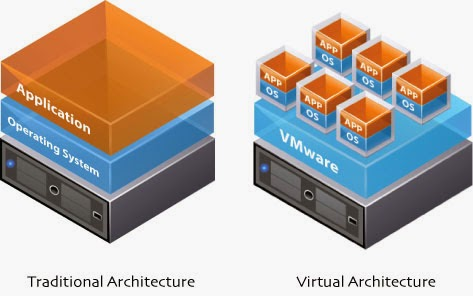
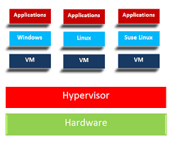
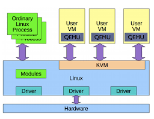
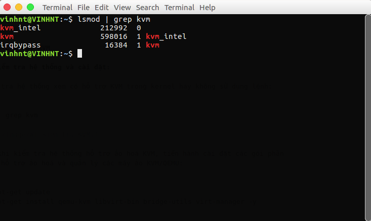
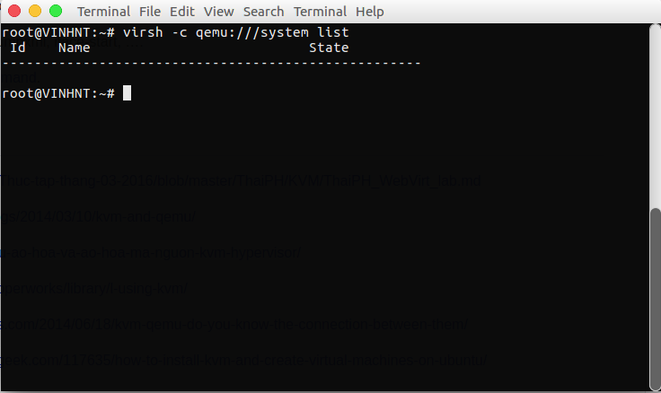

## Mục lục

- [1. Tổng quan về ảo hoá](#1)
- [2. Ảo hoá KVM - Kernel-Based Virtual Machine](#2)
	- [2.1 Một số đặt điểm của KVM](#21)
	- [2.2 Các tính năng của hệ thống ảo hoá KVM](#22)
	- [2.3 Cấu trúc ảo hoá KVM kết hợp QEMU](#23)
	- [2.4 Cài đặt KVM](#24)
	- [2.5 Cấu hình](#25)

## Nội dung

<a name="1"></a>

## 1. Tổng quan về ảo hoá:

Ảo hoá là chạy nhiều máy chủ ảo trên hạ tầng 1 máy chủ vật lý. Trên mỗi máy ảo có hệ điều hành riêng giống như một máy chủ thật và được triển khai các môi trường, ứng dụng khác nhau để phù hợp với mục đích sử dụng.



#### Lợi ích: 2 nhóm chính

- Giảm chi phí về hạ tầng IT và quản trị hệ thống
- Tăng hiệu suất và tính linh hoạt của hệ thống

#### Tính năng chính của ảo hoá

- Partitioning - Phân chia máy chủ vật lý
	+ Chạy nhiều máy ảo trên cùng 1 máy chủ vật lý
	+ Có cơ chế phân chia và phân phối tài nguyên tương ứng chính xác cho các máy ảo được khai báo và khởi tạo.
- Isolation - Cách ly máy ảo
	+ Cách ly các máy ảo với nhau: Đây là tính năng rất hiệu quả khi xảy ra sự cố, đặc biệt về An toàn thông tin, việc lây nhiễm từ một máy ảo sẽ hạn chế bị ảnh hưởng đến các máy ảo khác cũng như các hệ thống khác.
	+ Kiểm soát và tối ưu các tài nguyên hợp lý giữa các máy ảo, tránh các hiện tượng không kiểm soát tài nguyên và gây quá tải hoặc dư thừa tài nguyên trên các máy ảo.
- Encapsulation - Đóng gói máy ảo
	+ Đóng gói các máy ảo thành các file riêng biệt
	+ Dễ dàng sao chép và di chuyển các máy ảo sang các hệ thống khác, hoặc phục vụ sao lưu, dự phòng.
- Hardware Independent - Không phụ thuộc vào thiết bị phần cứng
	+ Ảo hoá được thiết kế phù hợp với tất cả các phần cứng có hỗ trợ công nghệ ảo hoá.

#### Hướng tiếp cận công nghệ ảo hoá

- Các giải pháp thương mại từ các hãng: **VMware(ESXi), Microsoft(Hyper-V), VMware WorkStation, Virtual PC, XenServer,...**. Ưu điểm dễ dàng triển khai và vận hành, được hỗ trợ tuy nhiên mất phí.
- Các giải pháp mã nguồn mở: **KVM, Qemu, Virtualbox,...**. Ưu điểm là có tính linh hoạt cao không mất phí, tuy nhiên khó khăn trong việc triển khai và vận hành đòi hỏi kỹ thuật cao.

#### Phân loại: 2 loại chính
- Loại 1: Bare-Metal Hypervisor Trong đó hypervisor tương tác trực tiếp với phần cứng của máy chủ để quản lý, phân phối và cấp phát tài nguyên. Bao gồm các giải pháp như: **VMware ESXi, Microsoft Hyper-V, Xen Server, KVM**



- Loại 2: Đây là loại ảo hoá Hypervisor giao tiếp với phần cứng thông qua hệ điều hành. Hypervisor lúc này được xem như một ứng dụng hệ điều hành và các phương thức quản lý cấp phát tài nguyên phải thông qua hệ điều hành. Loại này bao gồm các giải pháp như: **VMware workstation, Oracle VirtualBox, Microsoft Virtual PC,...**

Loại 1 Hypervisor tương tác trực tiếp với phần cứng nên việc quản lý và phân phối tài nguyên được tối ưu và hiệu quả hơn. Loại 1 thường được sử dụng trong thực tế loại 2 thường được sử dụng trong thử nghiệm, học tập.

<a name="2"></a>

## 2. Ảo hoá KVM - Kernel-Based Virtual Machine

<a name="21"></a>

### 2.1 Một số đặc điểm của KVM
- Về bản chất KVM không thực sự là một hypervisor có chức năng giải lập phần cứng để chạy máy ảo. Chính xác KVM chỉ là một **module của kernel Linux hỗ trợ cơ chế mapping các chỉ dẫn trên CPU ảo (guest VM) sang chỉ dẫn của CPU vật lý(của máy chủ chứa VM)**. KVM giống như một driver cho hypervisor để sử dụng được tính năng ảo hoá của các vi xử lý như Intel VT-x hay AMD-V, mục tiêu là tăng hiệu suất cho guest VM
- KVM được thiết kế để giao tiếp với các hạt nhân thông qua một kernel module có thể nạp được. 
- Trong kiến trúc của KVM, Virtual machine được thực hiện như là quy trình xử lý thông thường của Linux, được lập lịch hoạt động như các scheduler tiêu chuẩn của linux. Trên thực tế, mỗi CPU ảo hoạt động như một tiến trình xử lý của Linux. Điều này cho phép KVM được hưởng lợi từ các tính năng của nhân Linux.



<a name="22"></a>

### 2.2 Các tính năng của ảo hoá KVM

#### Security - Bảo mật

Vì được coi như 1 tiến trình xử lý của Linux nên nó tận dụng được mô hình bảo mật tiêu chuẩn của Linux để cung cấp khả năng điều kiển và cô lập tài nguyên. Nhân Linux sử dụng SELinux (Security-Enhanced Linux) để thêm quyền điều khiển truy cập, bảo mật và bảo mật đa tiêu chí, và thực thi chính sách bắt buộc. SELinux cung cấp cơ chế cách ly tài nguyên nghiêm ngặt và hạn chế cho các tiến trình chạy trong nhân Linux.

#### Memory management - Quản lý bộ nhớ

- KVM thừa kế tính năng quản lý bộ nhớ mạnh mẽ của Linux. Vùng nhớ máy ảo được lưu trữ trên cùng một vùng nhớ dành cho các tiến trình Linux khác và có thể swap. KVM hỗ trợ NUMA (Non-Uniform Memory Access - Bộ nhớ thiết kế cho hệ thống đa xử lý) cho phép tận dụng hiệu quả vùng nhớ kích thước lớn.
- KVM hỗ trợ các tính năng ảo mới nhất của các nhà cung cấp CPU để giảm thiểu mức độ sử dụng CPU và cho thông lượng cao hơn.
- Việc chia sẻ bộ nhớ được hỗ trợ thông qua một tính năng của nhân gọi là Kernel Same-page Merging (KSM). KSM quét tất cả các yêu cầu về vùng nhớ duy nhất để chia sẻ chung cho các máy ảo, lưu trữ vào một bản copy.

#### Storage - Lưu trữ

- KVM sử dụng khả năng lưu trữ hỗ trợ từ Linux để lưu trữ, nên có thể tận dụng hạ tầng lưu trữ đáng tin cậy.
- KVM cũng hỗ trợ các image của máy ảo trên hệ thống chia sẻ tập tin như GFS2 cho phép các image máy ảo được chia sẻ giữa các host hoặc các logical volumn.
- Định dạng image tự nhiên của KVM là QCOW2 – hỗ trợ việc snapshot cho phép snapshot nhiều mức, nén và mã hóa dữ liệu.

#### Live migration

-	KVM hỗ trợ live migration cung cấp khả năng di chuyển ác máy ảo đang chạy giữa các host vật lý mà không làm gián đoạn dịch vụ. Khả năng live migration là trong suốt với người dùng, các máy ảo vẫn duy trì trạng thái bật, kết nối mạng vẫn đảm bảo và các ứng dụng của người dùng vẫn tiếp tục duy trì trong khi máy ảo được đưa sang một host vật lý mới.
-	KVM cũng cho phép lưu lại trạng thái hiện tại của máy ảo để cho phép lưu trữ và khôi phục trạng thái đó vào lần sử dụng tiếp theo.

#### Performance and scalability

- KVM kế thừa hiệu năng và khả năng mở rộng của Linux, hỗ trợ các máy ảo với 16 CPUs ảo, 256GB RAM và hệ thống máy chủ lên tới 256 cores và trên 1TB RAM.

<a name="23"></a>

### 2.3 Cấu trúc ảo hoá KVM kết hợp QEMU


Trong đó:
- **User-facing tools:** Là công cụ quán lý máy ảo hỗ trợ KVM. Các công cụ có giao diện đồ hoạ (như virt-manager) hoặc giao diện dòng lệnh như (virsh) và virt-tool (các công cụ này được quản lý bởi thư viện libvirt)
- **Management layer**: Lớp này là thư viện libvirt cung cấp API để các công cụ quản lý máy ảo hoặc các hypervisor tương tác với KVM thực hiện các thao tác quản lý tài nguyên ảo hóa, bởi vì KVM chỉ là một module của nhân hỗ trợ cơ chế mapping các chỉ dẫn của CPU ảo để thực hiện trên CPU thật, nên tự thân KVM không hề có khả năng giả lập và quản lý tài nguyên ảo hóa. Mà phải dùng nhờ các công nghệ hypervisor khác, thường là QEMU.
- **Virtual machine**: Chính là các máy ảo người dùng tạo ra. Thông thường, nếu không sử dụng các công cụ như virsh hay virt-manager, KVM sẽ sử được sử dụng phối hợp với một hypervisor khác điển hình là QEMU.
- **Kernel support**: Chính là KVM, cung cấp một module làm hạt nhân cho hạ tầng ảo hóa (kvm.ko) và một module kernel đặc biệt chỉ hỗ trợ các vi xử lý VT-x hoặc AMD-V (kvm-intel.ko hoặc kvm-amd.ko) để nâng cao hiệu suất ảo hóa.

<a name="24"></a>

### 2.4 Cài đặt KVM

#### Kiểm tra hệ thống và cài đặt:

- Kiểm tra hệ thống xem có hỗ trợ KVM trong kernel hay không sử dụng lệnh:

```
lsmod | grep kvm
```


- Sau khi kiểm tra hệ thống hỗ trợ ảo hoá KVM, tiến hành cài đặt các gói phần mêm để hỗ trợ ảo hoá và quản lý các máy ảo KVM/QEMU:

```
sudo apt-get update
sudo apt-get install qemu-kvm libvirt-bin bridge-utils virt-manager -y
```

<a name="25"></a>

### 2.5 Cấu hình

- Ban đầu chỉ có người dùng root và các người dùng trong nhóm người dùng libvirtd (Nhóm người dùng có thể sử dụng các API trong thư viện quản lý ảo hoá libvirt) mới có quyền sử dụng máy ảo KVM. 

- Add thêm người dùng muốn sử dụng

```
sudo adduser <user_name> libvirtd
```

- Đăng xuất và đăng nhập lại chạy lệnh: 

```
virsh -c qemu:///system list
```



## Tham khảo
- [1.https://github.com/hocchudong/thuctap012017/blob/master/TamNT/Virtualization/docs/KVM/1.Tim_hieu_KVM.md](https://github.com/hocchudong/thuctap012017/blob/master/TamNT/Virtualization/docs/KVM/1.Tim_hieu_KVM.md)
- [2.http://blogit.edu.vn/gioi-thieu-ao-hoa-va-ao-hoa-ma-nguon-kvm-hypervisor/](http://blogit.edu.vn/gioi-thieu-ao-hoa-va-ao-hoa-ma-nguon-kvm-hypervisor/)
