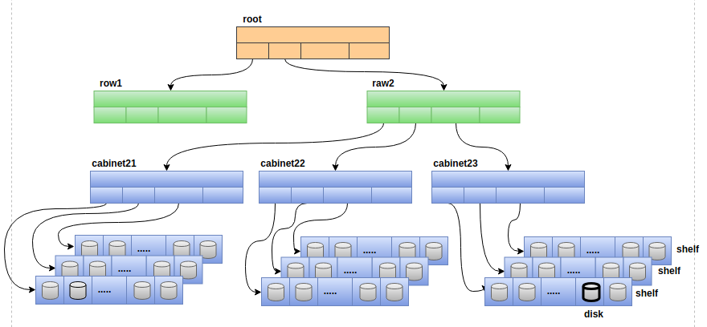
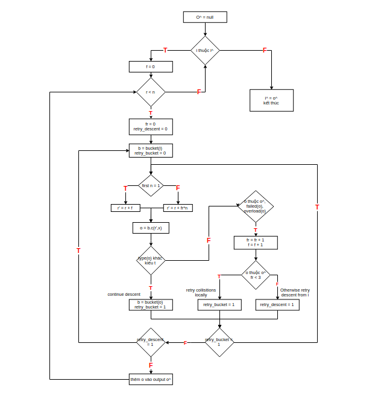

## MỤC LỤC 

- [1. CRUSH Algorithm](#1)
    - [1.1 Giới thiệu](#11)
    - [1.2 Cluster map phân cấp](#12)
    - [1.3 Replica placement](#13)
    - [1.4 Collisions, Failure, and overload](#14)
    - [1.5 Replica Rank](#15)
    - [1.6 Map changes and data movement](#16)
- [2. Bucket types](#2)

## NỘI DUNG

## 1. CRUSH Algorithm 

### 1.1 Giới thiệu

Thuật toán CRUSH xác định cách để lưu và lấy dữ liệu bằng việc tính toán các vị trí lưu trữ dữ liệu. crush trao quyền cho Ceph clients để kết nối trực tiếp với OSD thay vì thông qua một máy chủ (crush được đóng gói trong librados từ phía clients). Điều này giúp Ceph không bị mắc phải nhược điểm là single point of failure, performance bottleneck, và sự giới hạn về mặt vật lý đối với khả năng mở rộng của cluster.

Thuật toán crush phân tán dữ liệu objects giữa các thiết bị theo một giá trị trọng số trên thiết bị, bằng việt xấp xỉ một phân phối thống nhất. Phân phối là được điều khiển bởi một cluster map phân cấp. Cluster map biểu diễn các tài nguyên lưu trữ có sẵn và bao gồm các logical elements. (ví dụ: row, cabinets, shelves, physical disk). Chính sách phân phối dữ liệu là được định nghĩa trong placement rules. placement rules chỉ rõ dữ liệu được replica bao nhiêu lần, và những hạn chế nào được áp dụng cho các vị trí bản sao. Ví dụ có thể là số lượng replica là ba và được lưu trữ trên các thiết bị trong các physical cabinet khác nhau mà chúng không dùng chung nguồn điện hoặc network...

Cho một đầu vào giá trị x (số nguyên) crush sẽ đưa ra một list vector R của n mục tiêu lưu trữ khác nhau. crush sử dụng hàm hash nhiều đầu vào là số nguyên trong đó bao gồm x, việc tạo ra bản đồ được xác định hoàn toàn và tính toán độc lập bằng việc sử dụng cluster map, placement rules và x. Sự phân phối dữ liệu của crush là pseudo-random trong đó không có sự tương quan của kết quả đầu ra từ các đầu vào giống nhau hoặc items được lưu trong bất kỳ thiết bị lưu trữ nào.

### 1.2 Cluster map phân cấp

Cluster map bao gồm các thiết bị vật lý và các buckets, cả hai đều có một số id riêng và giá trị weight được liên kết với chúng. Buckets có thể chứa bất kỳ số lượng thiết bị nào hoặc các buckets khác. Các thiết bị lưu trữ được gán cho một weight để điều khiển lượng dữ liệu mà chúng chịu trách nhiệm lưu trữ. 
Weight có giá trị được tính từ dung lượng lưu trữ của thiết bị. Bucket weights được định nghĩa là tổng weights của các items (buckets hoặc các physical disk) bên trong mà nó bao gồm.

Buckets có thể được tạo thành một cách tùy ý để xây dựng hệ thống phân cấp đại diện cho các thiết bị lưu trữ có sẵn. Ví dụ một cluster map với shelf buckets ở mức thấp nhất để biểu diễn một tập các thiết bị xác định. Và tổ hợp các shelf bukets ta thành cabinet buckets để nhóm các shelves lại với nhau trong cùng một rack. cabinets buckets có thể được nhóm lại thành các row hoặc room buckets cho một hệ thống lớn. Dữ liệu được định vị trong mô hình phân cấp bằng việc lựa chọn đệ quy các buckets lồng nhau thông qua một pseudo-random khá giống hàm hash. crush là được dựa trên bốn kiểu buckets khác nhau, mỗi loại với một thuật toán lựa chọn khác nhau để chỉ ra kết quả dịch chuyển dữ liệu từ việc thêm hoặc xóa một thiết bị lưu trữ.

### 1.3 Replica Placement

crush được thiết kế để phân phối dữ liệu một cách thống nhất giữa các thiết bị được đánh trọng số weight để duy việc sử dụng lưu trữ và tài nguyên băng thông thiết bị được cân bằng. Vị trí replicas trên thiết bị lưu trữ trong mô hình phân cấp cũng có một ảnh hưởng quan trong đến độ an toàn của dữ liệu. Bằng việc phản ảnh tổ chức vật lý bên dưới của các thiết bị, crush có thể mô hình hóa và đưa ra các nguồn tiềm năng làm ảnh hưởng đến sự hỏng hóc của thiết bị lưu trữ. Các nguồn đó bao gồm physical proximity, nguồn cấp điện và mạng lưới internet. Bằng việc mã hóa các thông tin này vào trong cluster map, chính sách lưu trữ của crush có thể replicas các objects qua các failure domains khác nhau trong khi vẫn duy trì được phân phối mong muốn. Ví dụ như object được replicas ở các shelf, racks, raw khác nhau có nguồn cấp điện ở các vùng khác nhau đề phòng khi một nguồn cấp điện bị mất sẽ không ảnh hưởng đến độ an toàn của dữ liệu.

crush định nghĩa placement rules cho mỗi chiến lược replication để cho phép hệ thống lưu trữ xác định chính xác object replica được định vị như thế nào. Mỗi rule bao gồm một chuỗi các operations áp dụng cho mô hình phân cấp trong mộ môi trường thực thi đơn giản, như thuật toán dưới đây.

    take(a) đưa item a vào trong vector input

    thủ_tục select(n, t)
        output[] = rỗng
        for i in input do
        {
            f = 0
            for r = 1; r <= n do
            {
                fr = 0
                retry_descent = 0
                repeat
                {
                    b = bucket(i)                  bắt đầu descent với bucket i
                    retry_bucket = 0
                    repeat
                    {
                        if first_n =1 then
                            r' = r + f
                        else
                            r' = r + fr*n
                        o = b.c(r', x)
                        if type(t) khác t then
                        {
                            b = bucket(o)          Tiếp tục descent
                            retry_bucket = 1
                        } else if o thuộc output hoặc o là thiết bị lỗi (failed(o)) hoặc overload(o,x) then
                        {
                            fr = fr + 1
                            f = f + 1
                            if o thuộc output và fr < 3 then
                                retry_buket = 1
                            else
                                retry_desenct = 1
                        }
                    } until (retry_bucket = 1)
                } until (retry_descent = 1)
                output[k] = o       thêm o vào output
            }
        }

        input = output
    vector R = [input]          Thêm vector input và vector R

Đầu vào số nguyên là x là một object name hoặc là một id cho một nhóm object mà nhân bản của chúng sẽ được lưu trữ tại cùng các thiết bị. take(a) là hàm lựa chọn ra một item (thông thường là một bucket) bên trong mô hình phân cấp và sau đó gán vào vector input như là đầu vào cho các hoạt động con tiếp theo.

select(n, t) lặp lại trên mỗi phần tử i thuộc vector input và chọn ra n items riêng biệt trong cây con lấy gốc từ điểm i. Thiết bị lưu trữ là đã biết, có kiểu cố định và mỗi bucket trong hệ thống có một trường để phân biệt giữa các class bucket (ví dụ như giữa 2 row bucket và cabinet bucket có trường để phân biệt). Đối với mỗi i thuộc vector input, select(n, t) gọi lặp lại với r = 1 đến n items được yêu cầu, đệ quy xuống dưới qua các buckets, lựa chọn pseudo-randomly một item được lồng trong mỗi bucket bằng hàm c(r, x) (hàm này được định nghĩa cho mỗi loại buket), cho tới khi nó tìm thấy một item được yêu cầu là kiểu t (t có thể là raw, cabinets, shelf, disk).

### 1.4 Collisions, Failure, and overload

Hoạt động select(n, t) có thể  đệ quy nhiều mức trong mô hình phân cấp lưu trữ để xác định n items kiểu t bắt đầu từ điểm gốc của nó và quy trình này được tham số hóa bởi r = 1 ... n, r là số nhân bản đang được chọn. 

Trong suốt quá trình đệ quy crush có thể từ chối và chọn lại mội items bằng việc sử dụng tham số r' được sửa đổi từ r. Có 3 lý do items bị từ chối và crush phải chọn lại như sau: 

- items đã được chọn trong tập hiện tại (a collision - the select(n, t))
- thiết bị lưu trữ bị hỏng
- thiết bị quá tải.

Các thiết bị failed hay overload là được đánh dấu trong cluster map tuy nhiên vẫn còn lại trong hệ thống phân cấp để tránh việc dịch chuyển dữ liệu không cần thiết. crush dựa vào xác suất từ chối thiết bị có dữ liệu quá tải trong cluster map để phân phối lại items trên cluster bằng việc restart đệ quy tại điểm bắt đầu của select(n, t). Trong trường hợp collision r' được cập nhật qua mỗi lần được sử dụng ở các mức bên trong của đệ quy (không quay lại từ gốc) điều này tránh được việc làm lệch phân phối dữ liệu tổng thể khỏi các subtree nơi có collision có nhiều khả năng xảy ra.

### 1.5 Replica Rank

Parity và erasure coding schemes có yêu cầu vị trí hơi khác so với replication. 

Trong kịch bản primary copy replication crush sử dụng "first n" để tính toán r' = r + f (f là số lần thử placement thất bại bằng select(n,t)). 

Đối với primary và erasure coding thì rank hay vị trí của thiết bị là quan trọng bởi vì mỗi mục tiêu lưu trữ các bit khác nhau của object. crush sử dụng r' = r + fr*n để rank của thiết bị là giống nhau.

### 1.6 Map changes and data movement

Một phần quan trọng của việc phân phối dữ liệu trong một hệ thống lớn là việc thêm xóa tài nguyên lưu trữ (disk). crush duy trì một phân phối dữ liệu và tài thống nhất mọi lúc để tránh lãng phí tài nguyên. Khi một thiết bị trung gian fails, crush đánh dấu thiết bị nhưng vẫn để lại trong mô hình phân cấp, khi nó bị từ chối thì nội dung lưu vào nó sẽ được phân phối lại nhờ thuật toán crush. cluster map thay đổi một phần W(fails)/W(total) của dữ liệu để định vị lại mục tiêu lưu trữ mới và chỉ có dữ liệu trên thiết bị fails bị dịch chuyển.

Khi có một thiết bị thêm vào thì dữ liệu cũng chỉ bị dịch chuyển một phần là dW/W. dW là phần chênh lệch sau khi thêm thiết bị. Khi có thiết bị thêm vào thì các weight ở các subtrees sẽ bị thay đổi. Ví dụ như hình sau:

## 2. Bucket type

crush được thiết kế để đạt được 2 mục đích: hiệu quả và khả năng mở rộng của thuật toán lập bản đồ và tối thiểu việc di chuyển dữ liệu khi cân bằng cụm (khi cụm thêm hoặc xóa thiết bị). crush định nghĩa 4 loại buckets khác nhau để biểu diễn các node bên trong mô hình phân cấp của cụm: uniform bukets, list bukets, tree buckets và strawbuckets. Mỗi loại bucket dựa vào một cấu trúc dữ liệu bên trong và sử dụng một hàm c(r, x) khác nhau cho việc chọn nested items trong suốt quá trình replicas, đồng thời đại diện cho sự đánh đổi giữa việc tính toán vị trí và việc tổ chức lại dữ liệu khi được thêm vào hay xóa đi thiết bị.

| Action   | Uniform | list | tree | straw |
|---------:|:-------:|:----:|:-----:|:------|
| Speed | O(1) | O(n) | O(log n) | O(n) |
|Additions | poor | optimal | good | optimal |
|Removals | poor | poor | good | optimal |
