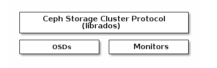
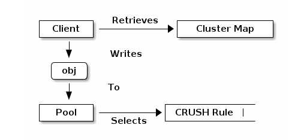
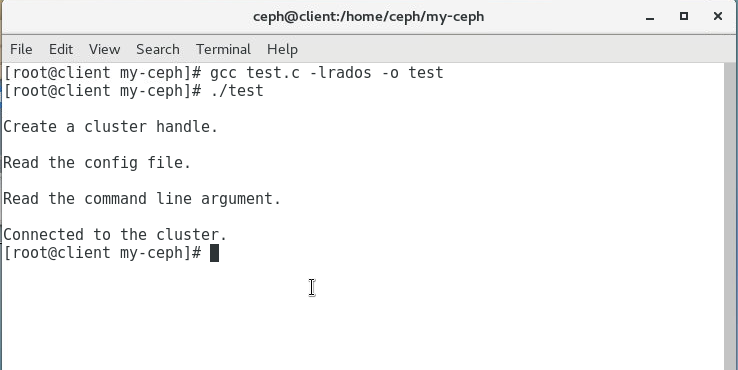
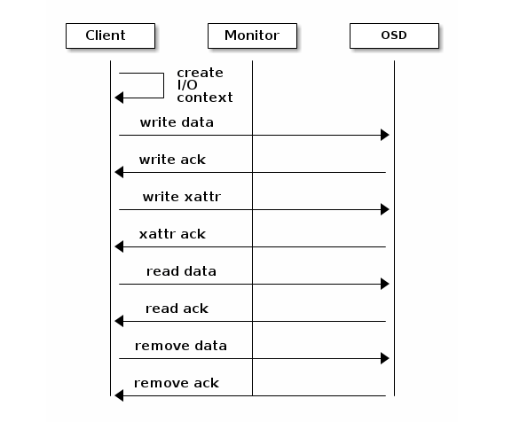
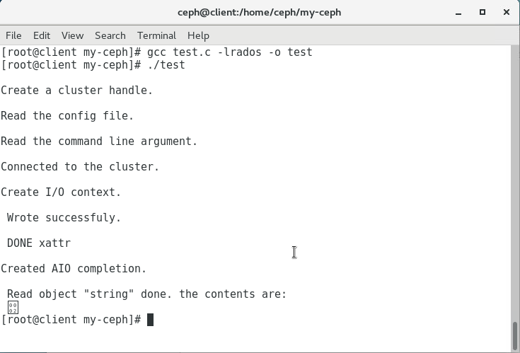
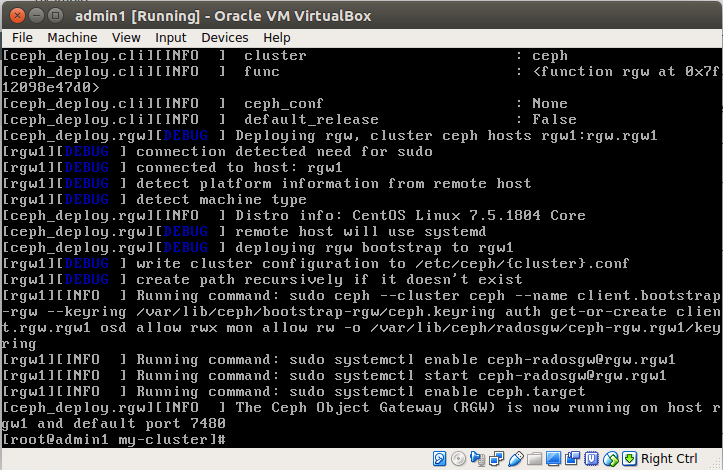
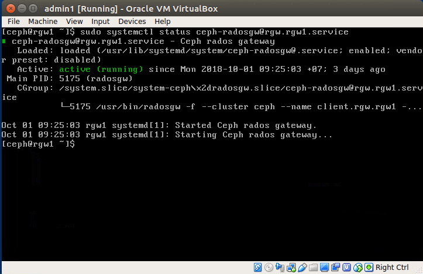

## MỤC LỤC

- [1. Ceph Storages cluster APIs](#1)
- [2. Cài đặt và cấu hình ceph object storage](#2)


## NỘI DUNG

<a name="1"></a>

### 1. Ceph Storage Cluster APIs

Ceph librados cho phép client (applications) tương tác với  Ceph monitor và Ceph OSD. librados cung cấp các hàm tới client dưới dạng một thư viện. client sử dụng thư viện librados hoặc các hàm chức năng tương ứng để thao tác với kiểu dữ liệu object và tương tác trực tiếp với Ceph.

librados API cho phép tương tác với 2 kiểu daemons trong ceph storage cluster:

- **Ceph monitor**: Duy trì bản coppy chính của cluster map.
- **Ceph OSD Daemon**: Lưu trữ dữ liệu như object trong node lưu trữ.



### Cài đặt thư viện librados trên centos 7

- librados cho C/C++:

```
sudo yum install librados2-devel
```

Kiểm tra các files headers khi cài xong tại đường dẫn /usr/include/rados

```
ls /usr/include/rados
```


- librados cho python:

```
sudo yum install python-rados
```

### Cấu hình Cluster handle

Ceph client apps thông qua librados tương tác trực tiếp với OSD để truy xuất dữ liệu. Ceph client apps gọi thư viện librados và kết nối tới một Ceph Monitor. librados lấy **Cluster map** từ Ceph monitor. Khi Ceph client app muốn viết hay đọc dữ liệu nó tạo một I/O context và liên kết với 1 pool. The pool được liên kết với một CRUSH Rule mô tả nơi dữ liệu được lưu trong cluster. Thông qua I/O context client apps cung cấp object name tới librados. librados lấy tên object, cluster map để tính toán Placement Group và OSD để lưu trữ dữ liệu. Khi mà client apps đã đọc và ghi dữ liệu thì không cần quan tâm đến mô hình của cluster nữa.



Các yêu cầu khi client application sử dụng cluster:

1. Tạo cluster handle: Dùng để kết nối tới storage cluster.
2. client applications phải cung cấp monitor address, username và authentication key (default: cephx)

Khi tạo ceph handle thì phải đọc ceph config để cấu hình handle. Một khi đã kết nối application có thể gọi hàm mà ảnh hưởng đến toàn bộ cluster.


Khi có cluster handle chúng ta có thể làm những công việc sau:

- Nhận các số liệu thống kê của cluster.
- Sử dụng thêm, tạo, sửa, xóa, liệt kê các pools chứa dữ liệu.
- Nhận và cài đặt file cấu hình.

Một trong những đặc trưng của Ceph là khả năng liên kết giữa các pools với nhau. Mỗi pool có một số lượng placement group, object replicas và replication strateges khác nhau. Một pool có thể được cài đặt như là một hot pool sử dụng SSD cho các object thường xuyên được sử dụng và cũng có thể cài đặt là một cold pool sử dụng cho trường hợp erasure coding.

### Tạo Cluster handle với C

```c
#include <stdio.h>
#include <string.h>
#include <rados/librados.h>

int main(int argc, char **argv)
{
    // Khai báo cluster handle và các argument được yêu cầu.
    rados_t cluster;
    char cluster_name[] = "ceph";
    char user_name[] = "client.admin";
    uint64_t flags;

    // Khởi tạo cluster handle.
    int err;
    err = rados_create2(&cluster, cluster_name, user_name, flags);
    if (err < 0){
        fprintf(stderr, "%s: Không thể tạo cluster handle %s\n", argv[0], strerror(-err));
        exit(EXIT_FALURE);
    } else 
        printf("\nTạo Cluster handle thành công\n");
    
    // Đọc file cấu hình của ceph cluster để cấu hình cho cluster handle.
    err = rados_conf_read_file(cluster, "/etc/ceph/ceph.conf");
    if (err < 0){
        fprintf(stderr, "%s: Không thể đọc tập tin cấu hình: %s\n", argv[0], strerror(-err));
        exit(EXIT_FAILURE);
    } else
        printf("\Đọc file cấu hình thành công\n");
    
    // Đọc command line arguments:
    err = rados_conf_parse_argv(cluster, argc, argv);
    if (err , 0){
        fprintf(stderr, "%s: ERROR!!! %s\n", argv[0], strerror(-err));
        exit(EXIT_FAILURE);
    }else
        printf("\nĐọc command line arguments thành công\n");
    
    // Kết nối tới cluster
    err = rados_connect(cluster);
    if (err < 0){
        fprintf(stderr, "%s: Không thể connect tới cluster: %s\n", argv[0], strerror(-err));
        exit(EXIT_FAILURE);
    }else
        printf("\nKet nối cluster thành công.\n");
}
```

Sử dụng trình biên dịch gcc (GNU C Compiler) để chạy trương trình. và link tới thư viện librados sử dụng -librados.

```
gcc test_connect.c -librados -o test_connect
```

Kết quả:

)

### Tạo I/O Context

Sau khi tạo xong cluster handle và kết nối tới cluster, chúng ta cần tạo một I/O context và bắt đầu đọc và viết dữ liệu. Một I/O context liên kết với một pool xác định. Các chức năng của I/O context bao gồm:

- Đọc, ghi dữ liệu và các thuộc tính mở rộng.
- Liệt kê và lặp các đối tượng, thuộc tính mở rộng của đối tượng.
- Snapshoot pool, list snapshoot, etc.



RADOS cho phép tương tác đồng bộ và không đồng bộ. Khi client application có một I/O context, read/write operation chỉ yêu cầu biết tên object và các thuộc tính mở rộng. Thuật toán CRUSH được đóng gói trong librados sử dụng cluster map để xác định các OSD thích hợp khi ghi dữ liệu. OSD daemon xử lý replication [Smart Daemons Enable Hyperscale](). Thư viện librados cũng map object tới các Placement Groups [Caculating PG IDs]().

Ví dụ tạo I/O contex với C

```c
#include <stdio.h>
#include <stdlib.h>
#include <string.h>
#include <rados/librados.h>

int main (int argc, const char **argv)
{
    rados_ioctx_t io;
    char *poolname = "data";

    err = rados_ioctx_create(cluster, poolname, &io);
    if (err < 0) {
        fprintf(stderr, "%s: cannot open rados pool %s: %s\n", argv[0], poolname, strerror(-err));
        rados_shutdown(cluster);
        exit(EXIT_FAILURE);
    } else {
        printf("\nCreated I/O context.\n");
    }

    /* Write data to the cluster synchronously. */
    err = rados_write(io, "person", "Vinh", 4, 0);
    if (err < 0) {
        fprintf(stderr, "%s: Cannot write object \"person\" to pool %s: %s\n", argv[0], poolname, strerror(-err));
        rados_ioctx_destroy(io);
        rados_shutdown(cluster);
        exit(1);
    } else {
        printf("\nWrote to object \"person\".\n");
    }

    char xattr[] = "1.7m";
    err = rados_setxattr(io, "person", "height", xattr, 4);
    if (err < 0) {
        fprintf(stderr, "%s: Cannot write xattr to pool %s: %s\n", argv[0], poolname, strerror(-err));
        rados_ioctx_destroy(io);
        rados_shutdown(cluster);
        exit(1);
    } else {
        printf("\nWrote \"1.7m\" to xattr \"height\" for object \"person\".\n");
    }

    rados_completion_t comp;
    err = rados_aio_create_completion(NULL, NULL, NULL, &comp);
    if (err < 0) {
        fprintf(stderr, "%s: Could not create aio completion: %s\n", argv[0], strerror(-err));
        rados_ioctx_destroy(io);
        rados_shutdown(cluster);
        exit(1);
    } else {
        printf("\nCreated AIO completion.\n");
    }

    /* Đọc dữ liệu sử dụng rados_aio_read. */
    char read_res[100];
    err = rados_aio_read(io, "person", comp, read_res, 12, 0);
    if (err < 0) {
        fprintf(stderr, "%s: Cannot read object. %s %s\n", argv[0], poolname, strerror(-err));
        rados_ioctx_destroy(io);
        rados_shutdown(cluster);
        exit(1);
    } else {
        printf("\nRead object \"person\". The contents are:\n %s \n", read_res);
    }

    /* Đợi cho operation hoàn thành */
    rados_aio_wait_for_complete(comp);

    /* giải phóng asynchronous I/O complete handle để tránh memory leaks. */
    rados_aio_release(comp);


    char xattr_res[100];
    err = rados_getxattr(io, "person", "height", xattr_res, 5);
    if (err < 0) {
        fprintf(stderr, "%s: Cannot read xattr. %s %s\n", argv[0], poolname, strerror(-err));
        rados_ioctx_destroy(io);
        rados_shutdown(cluster);
        exit(1);
    } else {
        printf("\nRead xattr \"height\" for object \"person\". The contents are:\n %s \n", xattr_res);
    }

    err = rados_rmxattr(io, "person", "height");
    if (err < 0) {
        fprintf(stderr, "%s: Cannot remove xattr. %s %s\n", argv[0], poolname, strerror(-err));
        rados_ioctx_destroy(io);
        rados_shutdown(cluster);
        exit(1);
    } else {
        printf("\nRemoved xattr \"height\" for object \"person\".\n");
    }

    err = rados_remove(io, "person");
    if (err < 0) {
        fprintf(stderr, "%s: Cannot remove object. %s %s\n", argv[0], poolname, strerror(-err));
        rados_ioctx_destroy(io);
        rados_shutdown(cluster);
        exit(1);
    } else {
        printf("\nRemoved object \"person\".\n");
    }
}
```
Một ví dụ thực hiện trên ceph storage:



### Closing session

Khi kết thúc I/O context và cluster handle, client app nên đóng kết nối và shutdown handle.

```c
rados_ioctx_destroy(io);
rados_shutdown(cluster);
```

## 2. Cài đặt và cấu hình Ceph Object Storage.

Từ thư mục chính của Admin node install Ceph Object Gateway packages tại rgw1 node.

```
ceph-deploy install --rgw rgw1
ceph-deploy admin rgw1
```

tiến hành thay đổi quyền cho file key tại rgw1

```
ssh rgw1
sudo chmod 644 /etc/ceph/ceph.client.admin.keyring
```

Trở về admin node và tạo một ceph object gateway trên rgw1

```
ceph-deploy rgw create rgw1
```



Thay đổi default port: thêm các dòng sau vào file cấu hình

```
[client.rgw.rgw1]
rgw_frontends = "civetweb port=80"
```

Đưa file cấu hình mới được cập nhật tới các node

```
ceph-deploy --overwrite-conf config push admin1 mon1 osd1 osd2 osd3 rgw1 client
```

Kiểm tra status rgw



