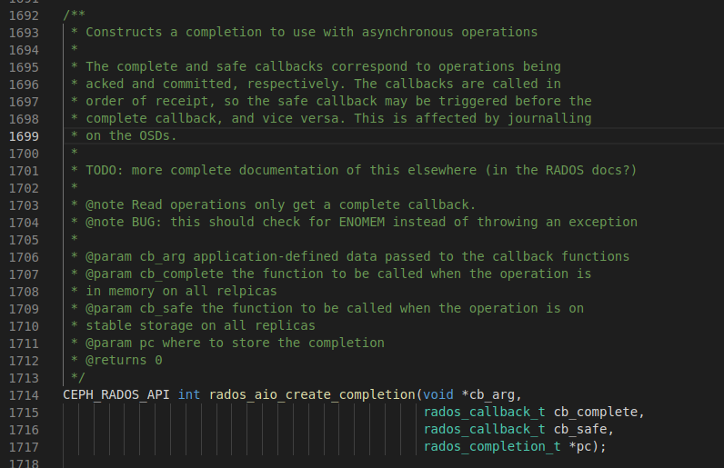
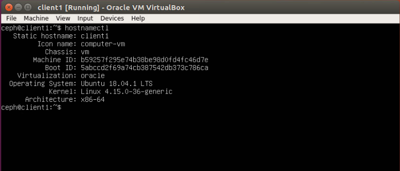
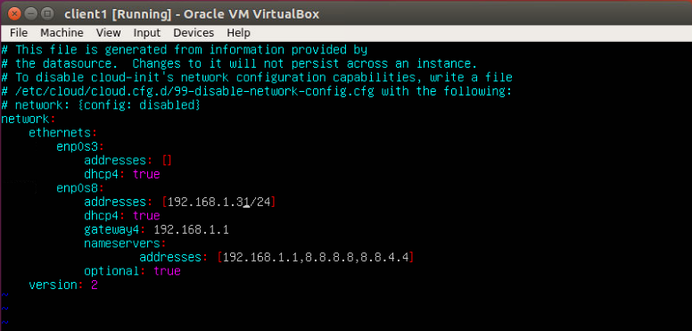
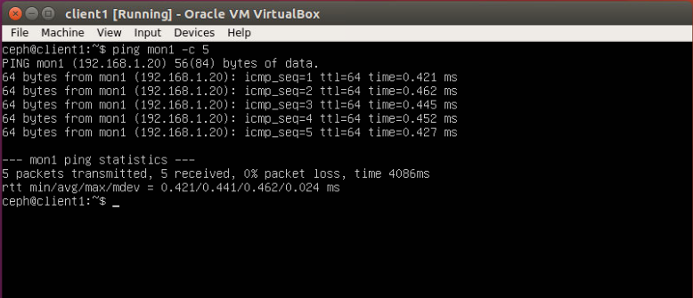
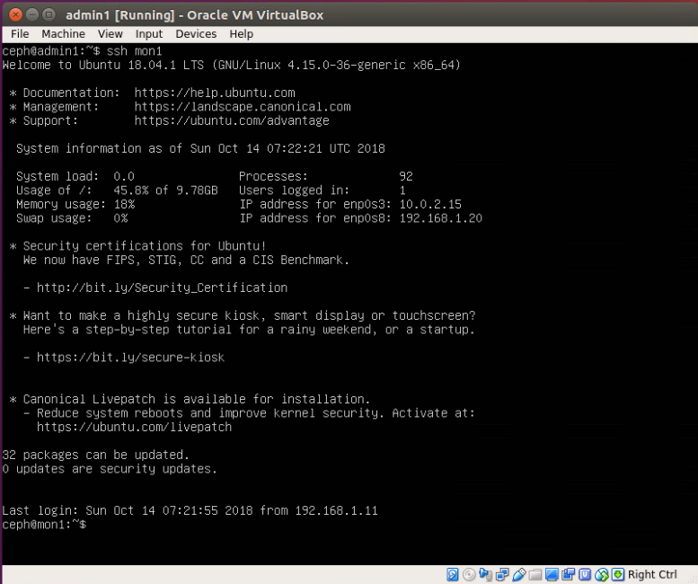
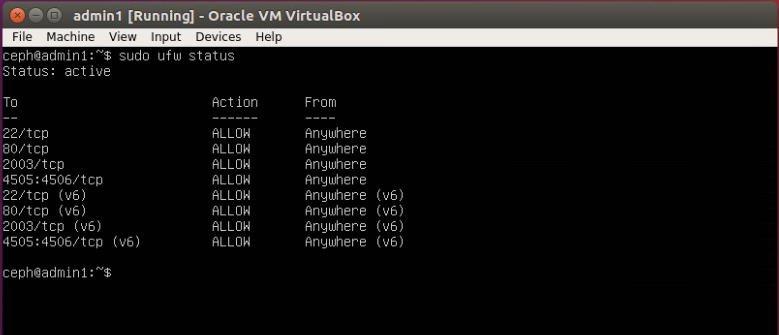
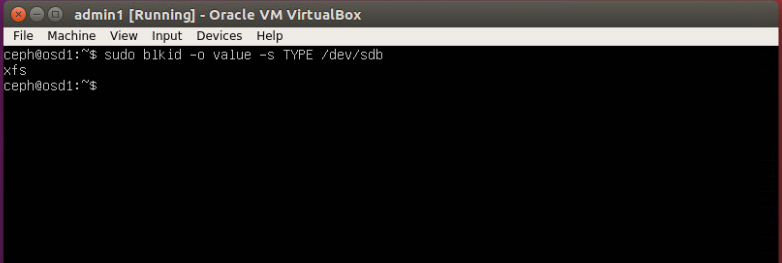
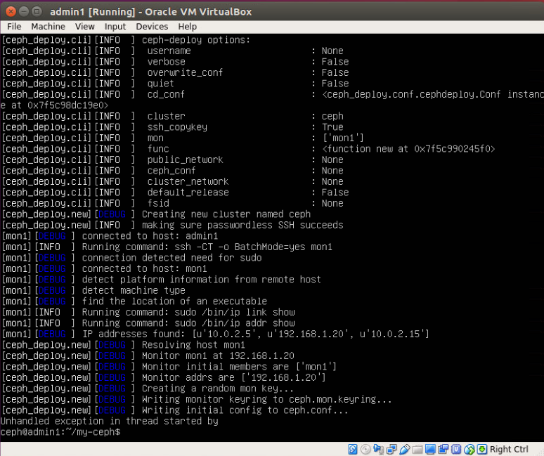
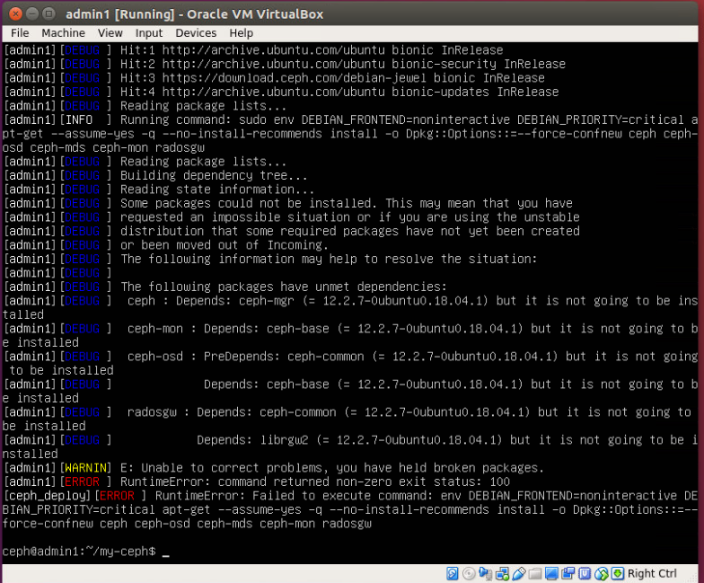

## MỤC LỤC

## NỘI DUNG

## 1. Tìm hiểu IOPS, Latency và Thoughput trong hệ thống cloud server

IOPS - Input/Output operation per Second là đơn vị đo lường sử dụng cho các thiết bị lưu trữ như HDD, SSD hoặc [SAN (Storage Area Network)]() - cho biết số tác vụ **write** hoặc **read** được hoàn thành trong một giây. Số IOPS thông thường được publish bởi các nhà sản xuất thiết bị, và không liên quan đến các ứng dụng đo lường hiệu năng. Tuy nhiên số IOPS không phải benchmark thực tế và số được cung cấp bởi các nhà sản xuất có thể không tương ứng với hiệu suất trong thực tế.

Cùng với tốc độ truyền, IOPS có thể được sử dụng để đo hiệu suất lưu trữ. Trong khi tốc độ truyền đo bằng bit thì IOPS được đo băng một số nguyên.

Throughput đo lường số lượng đơn vị thông tin mà một hệ thống có thể xử lý trong một khoảng thời gian. Đơn vị đo là bit/s.

IOPS và throughput không thể cung cấp một phép đo hiệu suất một cách chính xác.

Latency đo thời gian từ khi đưa ra request cho đến khi nhận được phản hồi (ACK). Latency có thể coi là thông số quan trọng nhất của hệ thống lưu trữ. Cùng với IOPS, là thước đo khoảng thời gian cần thiết cho môt yêu cầu I/O đơn lẻ được hoàn thành nhìn từ phía application.

Như vậy cùng với IOPS, latency, throughput có thể tạo thành một phép đánh giá hiệu suất tốt hơn đối với cloud server.

## 2. Đo latency các lần đọc ghi từ app thông qua librados tới ceph cluster

Các bước thực hiện như sau:

1. Tạo cluster handle
2. Đọc file ceph config
3. Kết nối tới cluster
4. Tạo một pool mới
5. Tạo IO Contex
6. Ghi từ ứng dụng với một số lần ghi
7. Đọc một só lần từ cluster
8. Tính thời gian đọc/ghi cho mỗi lần
9. Tính thời gian đọc/ghi trung bình

Để tính thời gian ghi từ application sử dụng thư viện <sys/time.h> để lấy các giá trị thời gian tại thời điểm như sau:

- Thời điểm bắt đầu ghi từ applications (start)
- Thời điểm tất cả dữ liệu ghi được replicas complete (ack_end)
- Thời điểm tất cả dữ liệu ghi đạt được stable storage trên tất cả các bản sao (commit_end)

Thư viện librados cung cấp các API để chúng ta có thể thực hiện được các điều trên. 

- **rados_aio_create_completion** là một hàm sẽ block cho đến khi operatios (ghi) hoàn thành và sau đó sẽ thực hiện các tác vụ rados_callback_t (đối với read operation chỉ thực hiện complete callback).



- **rados_callback_t** thực hiện callbacks cho asychronus operation IO (aio) sử dụng 2 tham số:
    - *rados_completion_t cb*: rados_completion_t biểu diễn trạng thái của một asynchronous operation nó bao gồm các giá trị trả về khi các operations được hoàn thành. Có thể được sử dụng để block cho đến khi operation complete hoặc safe.
    - *void *arg*: một tham số được applications định nghĩa để lấy dữ liệu khi opration hoàn thành. 
    


    Tại đây chúng ta sẽ định nghĩa hàm callback để truyền cho tham số này các thời gian ack_end và commit_end như sau:

```c
typedef struct{
    struct timeval start; // Thời điểm bắt đầu 
    struct timeval ack_end; // Thời điểm nhận ack báo đọc ghi thành công
    struct timeval commit_end; 
}req_duration;

void ack_callback(rados_completition_t comp, void *arg){
    req_duration *dur = (req_duration *) arg;
    gettimeofday(&dur->ack_end, NULL);
}

void commit_callback(rados_completion_t comp, void *arg){
    req_duration *dur = (req_duration *) arg;
    gettimeofday(&dur->commit_end, NULL)
}

```

cuối cùng chúng ta định nghĩa hàm ouput_append_latency cần các tham số sau:

- **rados_ioctx_t io**: IO contex cần tạo cho các read/write operation trước khi thực hiện
- **const char *data**: Dữ liệu được ghi
- **size_t len**: Độ dài dữ liệu ghi
- **size_t num_writes**: Số lần ghi (Ghi ở đây là asynchronous theo kiểu non-blocking :D )

vớ num_writes ta cần tạo rados_completion_t tương ứng để block cho mỗi lần ghi và req_duration tương ứng để ghi lại thời gian của mỗi operation.

```c
    req_duration time[num_writes]; //Khai báo một mảng (có số phần tử là số lần ghi) req_duatation 
    rados_completion_t comps[num_writes];
```

Trước khi bắt đầu ghi thực hiện lấy thời điểm bắt đầu ghi và lưu vào req_duration (time[i].start). sau đó gọi rados_aio_completion và bắt đầu ghi.

Sử dụng rados_io_flush(io) để chờ cho các request kết thúc và các callback complete (safe)

Tiến hành phân tích thời gian operation từ applications:

```c
int ouput_append_latency(rados_ioctx_t io, const char *data, size_t len, size_t num_writes){
    req_duration time[num_writes]; //Khai báo một mảng (có số phần tử là số lần ghi) req_duatation 
    rados_completion_t comps[num_writes];
    for (size_t i = 0; i < num_writes; ++i){
        gettimeofday(&time[i].start, NULL); // Lấy thời điểm bắt đầu ghi
        int err = rados_aio_create_completion((void*), &time[i], ack_callback, commit_callback, &comps[i]);
        if (err < 0){
            fprintf(stderr, "Error creating rados completion: %s\n", strerror(-err));
            return err;
        }
        char obj_name[100];
        snprintf(obj_name, sizeof(obj_name), comps[i], data, len);
        err = rados_aio_append(io, obj_name, comps[i], data, len);
        if (err < 0) {
            fprintf(stderr, "Error from rados_aio_append: %s", strerror(-err));
            return err;
        }
    }
    // Chờ tất cả các request kết thúc và callback complete
    rados_aio_flush(io);
    printf("Request # | ack latency (s) | Commit latency (s)\n");
    for (size_t i = 0; i < num_writes; ++i){
        //free completions
        rados_aio_release(comps[i]);
        struct timeval ack_latency, commit_latency;
        // Tinh thoi gian 
        timersub(&time[i].ack_end, &time[i].start, &ack_latency);
        timersub(&time[i].commit_end, &times[i].start, &commit_latency);
        printf("%9ld | %8ld.%06ld | %10ld.%06ld\n", (unsigned long) i, ack_latency.tv_sec, ack_latency.tv_usec, commit_latency.tv_sec, commit_latency.tv_usec);
    }
}
```

## 3. Cấu hình Ceph storage cluster trên ubuntu 18.04 server

### 3.1 Cấu hình mạng cho các node

#### Sửa hostname:

1. sử dụng command hostnamectl

```
sudo hostnamectl set-hostname osd1
```

2. Sửa file cloud.cfg: sửa trường preserve_hostname: false thành true tại đường dẫn /etc/cloud/cloud.cfg

Sau đó reboot lại hệ thống và kiểm tra

```
hostnamectl
```



#### Cấu hình địa chỉ IP

Thực hiện lệnh sau để sinh ra file cấu hình mạng:

```
sudo netplan generate
```

Để cấu hình địa chỉ IP cho ubuntu 18.04 server vào file /etc/netplan/50-cloud-init.yaml và chỉnh sửa các thông số như sau:



Mạng internet đã được cấu hình mặc định tại enp0s3 vì vậy ta cấu hình mạng local với điạ chỉ IP: 192.168.1.31 với netmask 255.255.255.0 và gateway là 192.168.1.1. Mục đích cấu hình địa chỉ này là để các máy trong cùng mạng lan này có thể ping thấy nhau.

Sau khi cấu hình xong tiến hành restart lại mạng

```
sudo netplan apply
```

Để ping được 2 máy với tên hostname thay vì địa chỉ IP ta tiến hành sửa file /etc/hosts theo tên hostname của các node và địa chỉ IP tương ứng vào cuối file nội dung sau:

```
192.168.1.11 admin1
192.168.1.20 mon1
192.168.1.21 osd1
192.168.1.22 osd2
192.168.1.23 osd3
192.168.1.31 client1
```

ping thử 2 máy trong mạng lan:
- mon1: 192.168.1.20
- client1: 192.168.1.31



#### Cấu hình ssh server cho các node

tại node admin thực hiện Generate ssh key cho user ceph:

```
ssh-keygen
```

Để có thể sử dụng ssh hostname tạo file ~/.ssh/config và thêm vào nội dung như sau:

```
Host admin1
Hostname admin1
User ceph
Host mon1
Hostname mon1
User ceph
Host osd1
Hostname osd1
User ceph
Host osd2 
Hostname osd2
User ceph
Host osd3
Hostname osd3
User ceph
```

cấp quyền read-write cho root và read cho các đối tượng còn lại

```
chmod 644 ~/.ssh/config
```

Copy ssh key tới tất cả các node sử dụng ssh-copy-id command:

```
ssh-keyscan mon1 osd1 osd2 osd3 client1
ssh-copy-id osd1
ssh-copy-id osd2
ssh-copy-id osd3
ssh-copy-id client1
```

Thực hiện ssh mon1 để kiểm tra kết quả.



#### Cấu hình tường lửa cho các node

Tại node admin bật các port 80, 2003, 4505-4506

```
sudo ufw allow 22/tcp
sudo ufw allow 80/tcp
sudo ufw allow 2003/tcp
sudo ufw allow 4505:4506/tcp
sudo ufw enable
sudo ufw status
```



- Tại mon1 bật các port 22, 6789.
- Tại osd1, osd2, osd3 bật các port 22, 6800:7300

#### Cấu hình Ceph OSD Nodes

Tạo 3 OSD node mỗi node có 2 phân vùng đĩa như sau:

- **/dev/sda** Phân vùng root
- **/dev/sdb** Phân vùng trống - 10GB

Đối với mỗi node tiến hành các bước sau:

Format phân vùng /dev/sdb với XFS filesystem và với 1 GPT partition table 

```
sudo parted -s /dev/sdb mklabel gpt mkpart primary xfs 0% 100%
```

Format phân vùng trong XFS format với mkfs command:

```
sudo mkfs.xfs -f /dev/sdb
```

Kiểm tra phân vùng

```
sudo blkid -o value -s TYPE /dev/sdb
```



#### Tạo Ceph Cluster

Tại Admin node cài ceph-deploy

```
sudo pip install ceph-deploy
```

Tạo mới một thư mục my-cluster và di chuyển vào thư mục mới tạo

Tạo một new cluster với ceph-deploy bằng việc định nghĩa monitor node là mon1

```
ceph-deploy new mon1
```



Chinh sửa file cấu hình ceph.conf

```
public network = 10.0.2.0/24
osd pool default size = 2
```

Lưu file lại và cài đặt ceph lên tất cả các node

```
ceph-deploy install admin1 mon1 osd1 osd2 osd3 client1
```

Hiện tại khi chuyển sang cài bản ubuntu. Sau khi chạy câu lệnh trên thì em đang gặp lỗi này.


