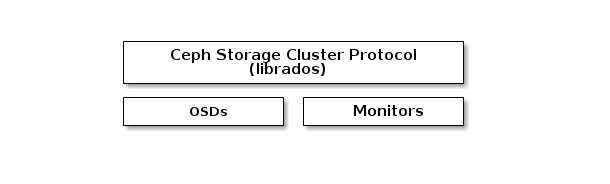
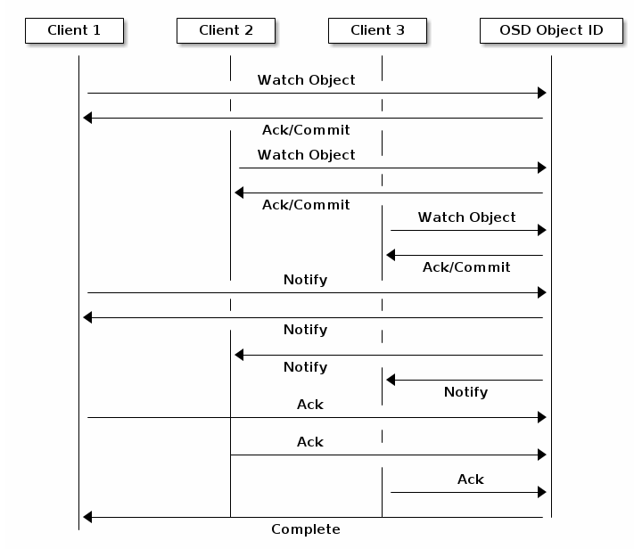
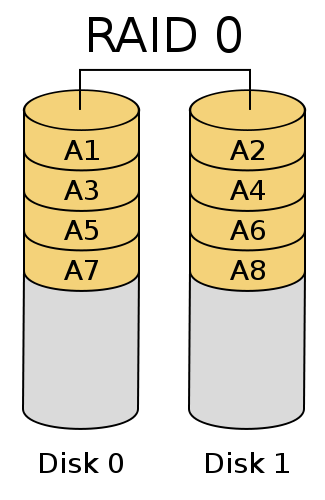
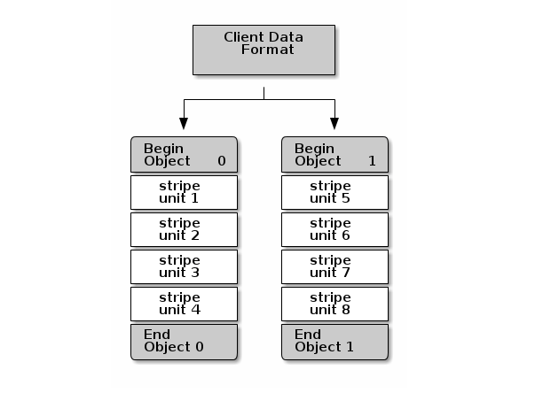
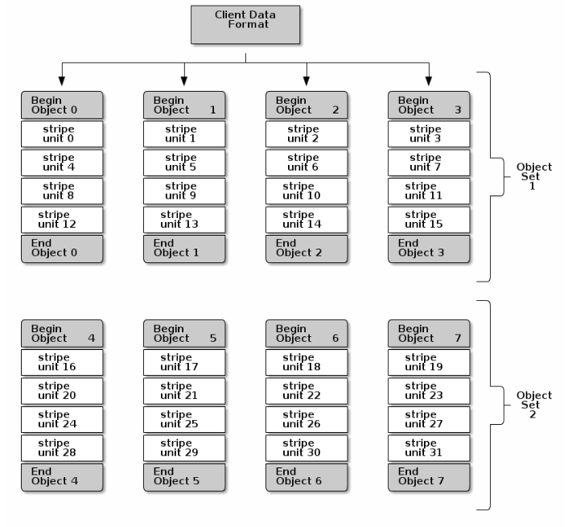
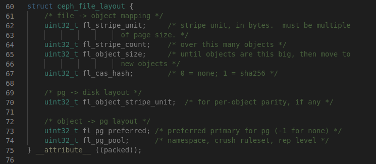
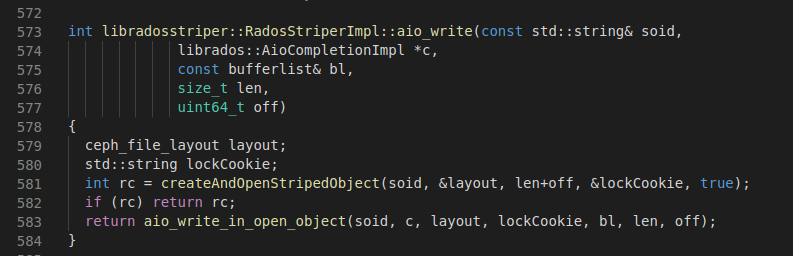
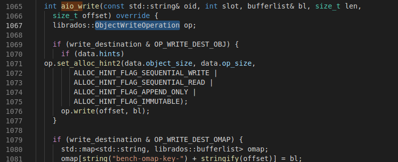
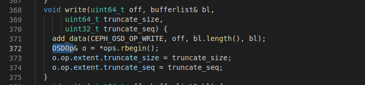

## Mục lục
- [1. Ceph protocol](#1)

    - [1.1 Native protocol và librados](#11)

    - [1.2 Object watch/notify](#12)

    - [1.3 Data Striping](#1.3)

- [2. libradosstriper API](#2)

## NỘI DUNG

## 1. Ceph protocol

Ceph clients sử dụng native protocol để tương tác với Ceph Storage Cluster. Ceph đóng gói các chức năng này trong thư viện librados vì vậy chúng ta có thể tạo custom Ceph clients. Kiến trúc cơ bản được mô tả như sau:

### 1.1 Native protocol và librados:

Các Ứng dụng hiện đại cần giao diện lưu trữ object đơn giản với khả năng truyền thông không đồng bộ. Ceph Storage cluster cung cấp một giao diện lưu trữ object đơn giản với khả năng truyền thông bất đồng bộ. Giao diện cung cấp các truy cập trực tiếp, parallel tới các objects trên toàn bộ cluster.

    - Pool operations
    - Snapshots và copy-on-write cloning
    - Read/Write Objects - Create or Remove - Entire object or byte range - Append or truncate
    - Create/Set/Get/Remove XATTRs (Các thuộc tính mở rông của đối tượng)
    - Create/Set/Get/Remove Key/Value Pairs
    - Compound operation và dual-ack semantics
    - Object Classes

### 1.2 Object Watch/Notify

Phía clients có thể tạo một sự liên kết liên tục với một object được lưu trong cluster và giữ phiên làm việc với primary OSD mở. Client có thể gửi một tin nhắn thông báo và Payload tới tất cả các watchers và nhận thông báo khi các watcher nhân thông báo. Điều này cho phép client sử dụng bất kỳ object nào như một kênh truyền không đồng bộ

### 1.3 Data Stripping (Việc phân chia dữ liệu)

Các thiết bị lưu trữ có một throughtput giới hạn. Điều này ảnh hưởng đến performance và scalability Vì vậy hệ thống lưu trữ thường hỗ trợ việc phân chia và lưu trữ các chuỗi pieces của dữ liệu thông qua nhiều thiết bị lưu trữ. Điều này làm tăng throughput và performance. Hình thức phân tách dữ liệu phổ biến nhất được biết đến là RAID.

*RAID (Redundant Array of Independent Disks) Là một công nghệ ảo hóa lưu trữ dữ liệu mà tổ hợp nhiều thành phần physical disks thành một hoặc nhiều logical unit cho mục đích dự phòng cho dữ liệu, cải thiện performance hay cả hai*

*Dữ liệu được phân tán trên các ổ đĩa theo một vài cách, được gọi là RAID levels. Tùy thuộc vào mức độ yêu cầu của redundantcy và performance. Mỗi RAID level cung cấp một sự cân bằng khác nhau giữa các tiêu chí chính: reliablity, avaibility, performance và capacity. Các RAID cao hơn RAID 0 cung cấp khả năng bảo vệ chống các lỗi đọc sector không thể phục hồi, cũng như chống lại sự hỏng hóc của toàn bộ ổ đĩa.*

*RAID 0 là loại RAID phổ biến và được sử dụng nhiều nhờ khả năng tăng hiệu suất đọc ghi khi trao đổ dữ liệu trên ổ cứng. Ví dụ có 2 ổ đĩa thì dữ liệu được*

*Ưu điểm của loại này là do dữ liệu được chia ra trên 2 ổ đĩa nên tốc độ đọc ghi nhanh gấp đôi. Tuy nhiên RAID 0 có nhược điểm là độ an toàn dữ liệu khi một trong 2 đĩa bị hỏng thì dữ liệu sẽ hỏng theo.*

Kiểu RAID mà tương tự như striping data của ceph là RAID 0. Do đó ceph có được ưu điểm tốc độ đọc ghi của RAID 0 tuy nhiên Ceph lại không mắc phải rủi ro về dữ liệu như RAID 0 là vì Ceph có thuật toán CRUSH, khi một trong các ổ đĩa bị down mà dữ liệu trước đó đã được clone, CRUSH sẽ clone dữ liệu ra bản tiếp theo và lưu sang các ổ đĩa khác.

Ceph cung cấp 3 kiểu clients: Ceph Block Device, Ceph Filesystem và Ceph Object Storage. Một ceph client chuyển đổi dữ liệu từ định dạng biểu diễn mà nó cung cấp (block device image, RESTful object, CephFS filysystem) thành object cho lưu trữ dữ liệu ở cluster.

    Object Ceph lưu trong cluster thì không được striped. Ceph Object Storage,  Ceph Block Device và Ceph Filesystem strip dữ liệu của chúng trên nhiều Ceph Stroage Cluster objects. Ceph client mà ghi trực tiếp tới cluster thông qua librados thì phải sử biểu diễn dưới dạng striping thì mới đạt được những lợi ích về performance.

Ceph Clients ghi các strip units tới Ceph Storage Cluster object cho tới khi objects ở mức dung lượng tối đa của nó, và sau đó tạo object khác cho các stripes thêm của data còn thừa. Hình thức đơn giản nhất của việc striping có thể đủ cho các block device images nhỏ, S3, hoặc Swift object và CephFS files. Tuy nhiên, hình thức đơn giản này không tận dụng được tối đa khả năng của Ceph để phân phối dữ liệu qua các placement groups, và hậu quả là không cải thiện được performance nhiều. 

Hình ảnh dưới đây mô tả cách striping data đơn giản này:

Nếu kích thước images, S3 or Swift object hoặc CephFS lớn chúng ta phải cân nhắc việc cải thiện read/write performance bằng việc striping dữ liệu client thành nhiều objects bên trong một object set. Đặc biệt hiệu suất ghi tăng đáng kể khi client ghi các strip units tới các object tương ứng một cách song song. Vì objects được map tớ các placement group khác nhau và xa hơn nữa là ở các OSD khác nhau nên mỗi lần ghi xảy ra song song thì sẽ tận dụng được tối đa tốc độ ghi của mỗi physical disk nằm trong các OSD. Một lần ghi tới một single disk có thể bị giới hạn bởi head movement (6ms mỗi lần tìm kiếm) và bandwidth của thiết bị. Bằng việc spreading mà ghi cùng lúc nhiều object (được map tới các placement group và OSD khác nhau) Ceph có thể giảm được số lần tìm kiếm trên mỗi ổ đĩa và tổ hợp throughput của nhiều đĩa để đạt được tốc độ đọc ghi nhanh hơn. 

Việc Striping là độc lập với các bản sao objects. Vì CRUSH tạo bản sao của objects qua các OSD nên Stripes được nhân rộng một cách tự động và đây cũng chính là nguyên nhân mà ceph không bị mắc vào nhược điểm của RAID 0.

Trong hình trên, dữ liệu client được stripe qua các object set. Mỗi object set bao gồm 4 objects, Stripe unit đầu tiên là stripe unit 0 tại object 0 và stripe unit thứ tư là stripe unit 3 tại object 3. Sau việc ghi stripe thứ 4, client xác định nếu object set là đầy. Nếu object set mà chưa full thì clients bắt việc ghi một stripe tiếp theo quay lại object 0. Nếu object set là full thì client sẽ tạo ra một object set mới (object set 2) và bắt đầu việc ghi với stripe đầu tiên là stripe unit 16 của dữ liệu tại object đầu tiên (object 4) ở object set 2.

Ba biến quan trọng xác định hình thức ceph stripe dữ liệu là:

**Object size**: Object trong Ceph Cluster có cấu hình kích thước maximum (2MB, 4MB, ...). Object size nên là một số đủ lớn để có thể đủ chứa nhiều stripe units, và phải là bội của stripe units.

**Stripe Width**: Stripes có một kích thước đơn vị được cấu hình (e.g 64KB). Ceph client chia dữ liệu của nó sẽ ghi thành các đơn vị stripes có cùng kích thước (ngoại trừ stripe unit cuối cùng). Một stripe width nên là một phần của object size để một object có thể bao gồm nhiều stripe units.

**Stripe Count**: Ceph client ghi một chuỗi các stripe unit lên một series các object được xác định bởi strip count. Series objects được gọi là một object set. Sau khi ceph client ghi tới object cuối cùng trong object set, nó trở về object đầu tiên trong object set. Hay nói cách khác **stripe count** chính là số object có trong một object set.

Một điều quan trọng là chúng ta phải test performance của cấu hình striping trước khi đưa cluster thành sản phẩm. Vì không thể thay đổi tham số striping sau khi chúng ta stripe dữ liệu và ghi tới objects trong ceph cluster.

Một khi ceph client đã stripe data thành các stripe unit và map stripe unit tới các objects, Thuật toán CRUSH của Ceph sẽ map object tới các placement groups, và placement group tới ceph OSD daemons trước khi object được lưu như các file trong physical disk.

Vì một client sẽ ghi vào một single pool, nên tất cả data được stripe thành objects được map tới placement group trong cùng một pool. Vì vậy Chúng sử dụng cùng một CRUSH map và cùng các điều khiển truy cập.

## 2. libradosstriper API

Ceph cung cấp libradosstriper API để phía client có thể strip data và gửi tới cluster cũng như có thể đọc từ cluster với performance cao.

Trước tiên nếu chúng ta muốn sử dụng libradosstriper thì chúng ta phải cấu hình ba tham số liên quan đến việc striping data của client đó là **object size**, **stripe unit**, và **stripe count**. libradosstriper tạo một layout để cấu hình các tham số trên. Layout này sẽ được sử dụng mỗi khi có thêm các object được tạo. Các object có sẵn sẽ được mở với layout của nó.

Các API để cấu hình ceph file layout:

Đối với stripe unit và object size có kích thước tối thiểu là 64kb. Thông thường object size sẽ là bội của stripe unit (không xảy ra trường hợp object size nhỏ hơn stripe unit). Stripe count sẽ là một số nguyên lớn hơn 0.

Sau khi cấu hình xong ceph file layout chúng ta có thể thực hiện ghi dưới hình thưc stripe data:

Các bước thực hiện của hàm write trong libradosstriper như sau:

1. Mở hoặc tạo các object nếu cần thiết. gọi hàm createAndOpendStripeObject(...), sau đó load ceph file layout vào cho object.

2. Gọi write_in_open_object(...)

3. Hàm write_in_object sử dụng gọi đến hàm internal_aio_write(...)

Tại đây sẽ chia các phần của đối tượng thành một list bộ đệm đơn. Sau đó sử dụng class IoCtx của librados để gọi ra aio_write(...). Tiếp tục phương thức này sử dụng class ObjectWriteOperation của librados để gọi ra phương thức write(...).

4. write sử dụng OSD operation gọi tới API memset của kernel để đưa dữ liệu vào physical disk.

