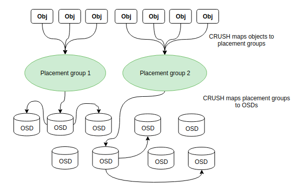
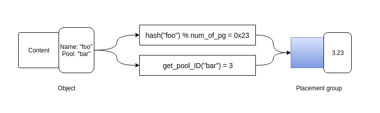
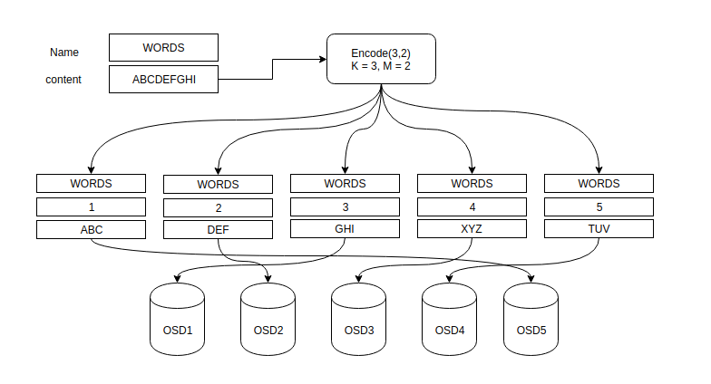
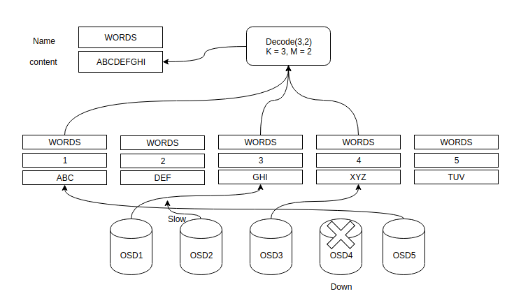
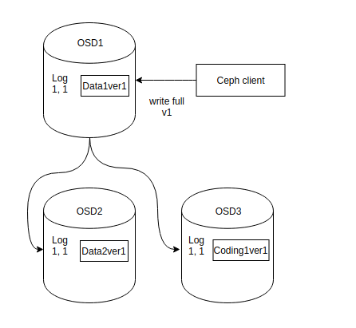
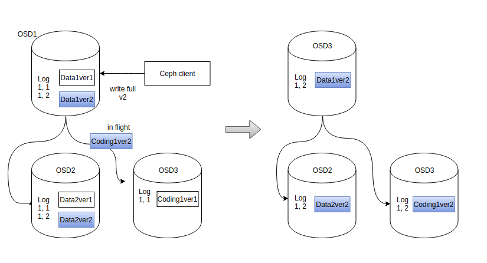

## MỤC LỤC
- [1. Mapping các Placement group tới các OSD](#1)
- [2. Erasure coding](#2)

## NỘI DUNG

## 1. Mapping các placement group tới các OSD

Mỗi pool có một số lượng các placement groups. CRUSH ánh xạ các placement group tới OSD một các tự động. Khi ceph client lưu trữ các object, thông qua librados các object được ghi vào pool được chỉ định. Tại đây các object được phân chia ra thành các placement groups và CRUSH sẽ map các placement group tới các OSD.

Việc mapping các object vào các placement group tạo ra một lớp gián đoạn giữa Ceph OSD và Ceph client. Ceph cluster phải có khả năng mở rộng, rebalance nơi nó lưu trữ các object một cách tự động.
Thuật toán CRUSH map mỗi objects tới một placement group và map các placement groups tới một hoặc nhiều OSD. Điều này cho phép ceph rebalance một cách tự động khi ceph OSD daemon khi các Ceph OSD Daemon và các thiết bị OSD bên dưới được thêm vào. Sơ đồ sau mô tả CRUSH map object tới placement group và map placement group tới OSD.

Với bản sao cluster map lấy từ monitors và thuật toán CRUSH, client có thể tính chính xác OSD nào để sử dụng khi đọc hoặc ghi objects.

### Tính toán Placement group ID

Khi ceph client kết nối với ceph monitors sẽ lấy một bản sao cluster map. Với bản sao cluster map này client biết về tất cả monitors, OSDs, và metadata server trong cluster. **Tuy nhiên nó không biết gì về các vị trí của các objects được lưu trong các OSDs. Vị trí của các object sẽ được tính. Đầu vào duy nhất yêu cầu từ phía client là object ID và tên của pool. Khi client muốn lưu trữ một object nó tính toán một placement group bằng việc sử dụng object name, một hash code, và số placement group trong pool và tên của pool. Ceph clients tính placement group IDs theo các bước sau:

- 1. Client đưa đầu vào là tên pool và object ID.
- 2. Ceph sử dụng hàm hash để băm object ID.
- 3. Ceph tính hash modulo (chia lấy dư) cho số PG để nhận PG ID
- 4. Ceph nhận pool ID từ pool name đã cho
- 5. Ceph thêm pool ID vào PG ID

Tính toán vị trí các đối tượng là nhanh hơn nhiều so với việc truy vấn vị trí của đối tượng trong cluster. Thuật toán CRUSH cho phép clients tính nơi object được lưu và cho phép client tương tác trực tiếp tới OSD chính để lưu hoặc lấy dữ liệu.

## 2. Erasure coding

Erasure coding là một phương thức bảo vệ dữ liệu trong đó dữ liệu bị phân cắt thành nhiều fragments, được mở rộng, được mã hóa với các mẩu dữ liệu dư thừa và được lưu trữ trên các vị trí khác nhau hoặc các thiết bị lưu trữ khác nhau.

Mục tiêu của Erasure coding là cho phép dữ liệu bị hỏng ở một số điểm trong quá trình lưu trữ đĩa và được xây dựng lại bằng việc sử dụng thông tin về dữ liệu được lưu trữ ở nơi khác trong mảng. Erasure code thường được sử dụng thay thế RAID vì khả năng giảm thời gian và chi phí cần thiết để tái tạo lại dữ liệu. 

Erasure coding sẽ làm giảm dung lượng đĩa cần thiết để đảm bảo độ bền của dữ liệu tuy nhiên hạn chế của erasure coding là nó có thể tiêu tốn nhiều CPU hơn và có thể làm tăng latency.

Erasure coding có thể hữu ích với số lượng dữ liệu lớn và bất kỳ ứng dụng hay hệ thống nào cần đến khả năng chịu nhiều lỗi, như disk array system, data grids, ứng dụng lưu trữ phân tán, object store. Một trong những use case hiện tại phổ biến nhất cho erasure coding là lưu trữ đám mây dựa trên nền tảng object. (object-base cloud storage).

Erasure coding tạo một hàm toán học để miêu tả một tập số để chúng có thể được kiểm tra về độ chính xác và được phục hồi nếu một trong số chúng bị mất. Đa thức nội suy và oversampling là 2 khái niệm key của erasure coding. Trong toán học sự bảo vệ được tạo bởi erasure coding có thể biểu diễn một form đơn giản như sau:

n = k + m

- Biến k là số lượng dữ liệu gốc. 
- Biến m là ký hiệu của phần thêm vào của dữ liệu để bảo vệ khỏi các lỗi.
- Biến n là tổng số ký hiệu được tạo sau quá trình erasure coding.

Ví dụ erasure coding 10/16 tức là thêm 6 ký tự (m) vào 10 ký tự gốc (k) và 16 mảnh dữ liệu (n) sẽ được lưu trữ trên các thiết bị, nodes hoặc các vị trí địa lý khác nhau. Tệp gốc có thể được tái tạo từ 10 mảnh được xác minh. Sáu mảnh dữ liệu có thể bị mất trên các thiết bị, nodes lưu trữ nhưng chỉ cần 10 mảnh thì dữ liệu gốc sẽ được khôi phục. Erasure coding được biết đến như là forward error corection codes.

## Erasure coding trong Ceph

Một erasure coded pool lưu trữ mỗi object như K+M chunks. Nó được chia thành K data chunks và M coding chunks. The pool được cấu hình để có kích thước K + M vì vậy mỗi chunks được lưu trữ trong một OSD trong tập biểu diễn. Rank của chunk thì được lưu trữ như là một thuộc tính của đối tượng.

Một ví dụ về erasure coded pool được tạo để sử dụng 5 OSD (K + M = 5, K = 3, M = 2) và có thể chịu được mất 2 OSD mà dữ liệu vẫn được tái tạo.

### Đọc và ghi encoded chunks

Khi object WORDS có nội dung ABCDEFGHI được ghi vào pool, hàm erasure coding phân cắt nội dung thành 3 chunk dữ liệu một cách đơn giản bằng việc chia nội dung thành ba: chunk đầu tiên là ABC, chunk thứ 2 là DEF chunk cuối là GHI. Nội dung sẽ được thêm vào nếu không phải là bội số của K. Hàm này cũng tạo ra 2 đoạn mã thứ tư, năm là XYZ và TUV từ dữ liệu đầu vào. Mỗi chunk được lưu trữ ở một OSD trong tập 5 OSD. Các chunks được lưu trữ dưới hình thức object và có cùng tên của object ban đầu là WORDS nhưng được lưu trữu tại các OSD khác nhau. Thứ tự các chunk được tạo ra phải được bảo toàn và được lưu trữ như một thuộc tính riêng của đối tượng ngoài tên của nó.

Các bộ encode và decode có sẵn trong các OSD. Khi object WORDS được đọc từ erasure coded pool thì hàm decoding đọc cần 3 chunk để tái tạo lại dữ liệu gốc. Nó được thông báo là chunk 2 và chunk 5 đã bị miss (chúng được gọi là "erasure") chunk 5 thì không dọc được vì OSD 4 bị down. Hàm decode sẽ được gọi ngay sau khi 3 chunks được đọc vì OSD2 bị đọc chậm nên chunk 2 cũng sẽ không được tính đến.

## Interupted full writes

Trong một erasure coded pool, OSD chính hoạt động và nhận tất cả các hoạt động ghi từ phía clients. OSD chính chịu trách nhiệm cho encoding payloard thành các chunks (K + M chunks) và gửi chúng đến các OSD khác phục vụ việc replicas. OSD chính cũng chịu trách nhiệm cho việc duy trì môt phiên bản ủy quyền cho placement group log ?

Theo mô hình bên dưới erasure coded pool được tạo với K = 2 và M = 1, tương ứng là 3 OSD, 2 cho K và 1 cho M. Một object được encode và lưu trữ trong OSD. chunk Data1ver1 được lưu trên OSD1 Data2ver1 được lưu trên OSD2 và Coding1ver1 được lưu tại OSD3. Placement group logs trên mỗi OSD là giống hệt nhau (1, 1 cho epoch 1, version 1).

OSD1 là OSD chính và nhận WRITE FULL từ một client, điều này có nghĩa payload là thay thế object hoàn toàn thay vì ghi đè lên một vùng nào đó. Version 2 của object được tạo để ghi đè lên version 1. OSD1 mã hóa payload thành 3 chunks Data1ver2 được lưu trên OSD1 Data2ver2 lưu trên OSD2 và  Coding1ver2 lưu trên OSD3. Mỗi chunks là được gửi tới target OSD. Bao gồm OSD chính cái chịu trách nhiệm cho việc lưu trữ các chunks. Ngoài ra để xử lý hoạt động ghi và duy trì một phiên ủy quyền của placement group logs. Khi OSD nhận message hướng dẫn để ghi các chunks nó cũng tạo ra một mục mới trong placement group logs để phản ánh sự thay đổi.

Ví dụ: ngay khi OSD3 lưu Coding1ver2 nó thêm vào mục 1,2 (epoch 1, version 2) tới logs. Bới vì OSD hoạt động không đồng bộ nên một vài chunks có thể still be in flight (như Coding1ver2 đang trên đường đến) trong khi các chunks khác đã báo nhận trên disk (như Data1ver2, Data2ver2). 

Nếu không có lỗi gì xảy ra thì các chunks đều được ghi vào các OSD tương ứng. Ngay sau đó các chunks lưu giữ phiên bản trước và log tương ứng của chúng sẽ bị xóa khỏi các OSD.

Tuy nhiên trong quá trình Coding1ver2 đang được ghi từ OSD1 đến OSD3 mà OSD1 bị down và dữ liệu version 2 mới chỉ được ghi một chunks vào OSD2. Như vậy Data version 2 sẽ không được tái tạo vì chỉ còn môt chunks ở OSD2. Lúc này **một OSD khác** trở thành OSD chính (OSD4) và nhận thấy last complete log là 1,1 sẽ được ghi vào OSD4. OSD4 nhận thấy log 1,2 ở OSD2 khác với log của nó và sẽ loại bỏ tập tin được ghi tương ứng với log 1,2. Data1ver1 được tái tạo lại từ các chunks version 1 đang được lưu tại OSD2 và OSD3. 

