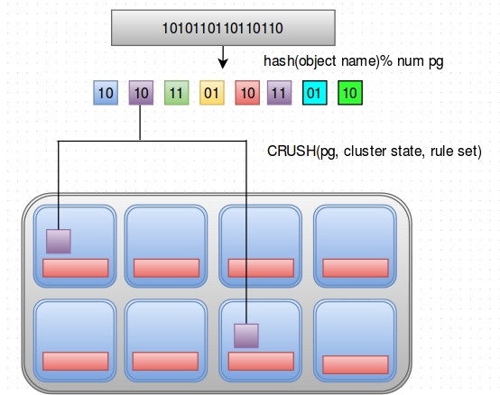
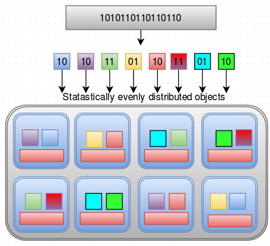

## CRUSH - Controlled Replication Under Scalable Hashing

CRUSH là một thuật toán mà Ceph client sử dụng để place object của nó trong Ceph Storage cluster. Thuật toán là Pseudo-random với tốc độ tính toán nhanh và không cần central lookup table

Hoạt động:

Nếu có một object cần được lưu trữ trong Ceph Storage Cluster thì Ceph client đầu tiên sẽ băm (hash) object name và chia nó thành các Placement Group (PG). Placement Group là chỉ được chia dựa vào names.

Ceph client biết được các object thuộc về Placement group nào. Sau đó CRUSH algorithm được gọi trên mỗi PG đó cùng với Cluster State và Rule Set được lấy từ Ceph Monitors có sẵn trong Cluster. Và dựa vào những cái này, CRUSH thực hiện một vài tính toán để đặt object chỗ nào trong Cluster. Việc tính toán xảy ra bởi chính nó với tốc độ cao. Do vậy không cần phần mềm hay server chuyên dụng nào tìm chỗ lưu trong cluster. 

Sau đó CRUSH phân phối đồng đều các đối tượng vào các OSD có sẵn trong cluster.

Nếu 1 client request một object từ Cluster, nó sẽ tính toán Placement group và gọi CRUSH và CRUSH sẽ đưa ra những OSD nào để tìm. Nó chỉ ra nơi dữ liệu đang được lưu trong cluster 