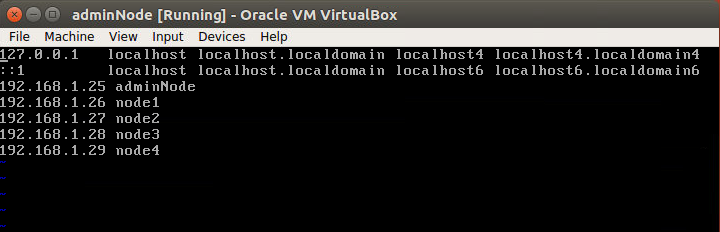
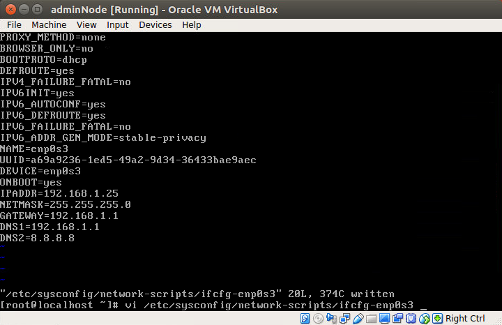
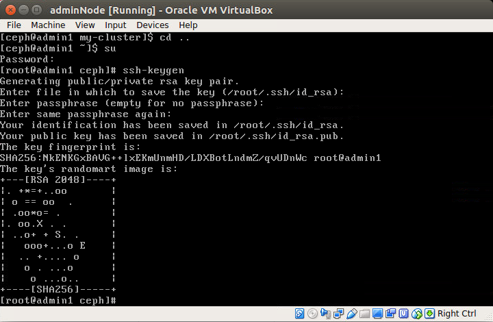
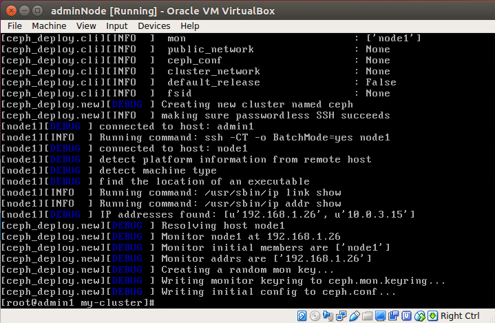
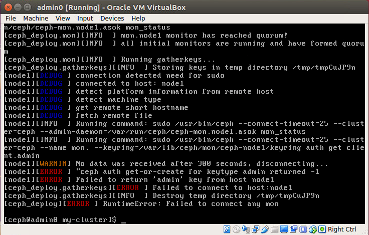

## Mục lục 
- [1. Các kiểu dữ liệu lưu trữ trong cloud computing](#1)
    - [Block device](#block-device)
    - [File](#file)
    - [Object storage](#object-storage)
    - [So Sánh 3 loại dữ liệu](#so-sanh)
- [2. Các kiểu dữ liệu trong ceph storage](#2)
- [3. Ceph-deploy toolkit - Tạo một ceph cluster đơn giản](#3)
    - [3.1 Cấu hình tất cả các node](#3.1)
    - [3.2 Cấu hình ssh server](#3.2)
    - [3.3 Cấu hình ceph storage cluster](#3.3)

## Nội dung

## 1. Các kiểu dữ liệu lưu trữ trong cloud computing

<a name="block-device"></a>

### Block device

Block storage device lưu trữ dữ liệu bằng cách chia dữ liệu thành các khối nhỏ có kích thước bằng nhau. Hệ thống lưu trữ có thể thực hiện việc này mà không cần cấu trúc tệp vì mỗi khối dữ liệu có một địa chỉ duy nhất. Điều này cho phép hệ thống lưu trữ phân tán các khối dữ liệu nhỏ hơn ở bất cứ nơi nào trong hệ thống mà nó thấy hiệu quả nhất. Phần mềm hệ thống lưu trữ tập hợp các khối cần thiết lại với nhua để tạo thành tệp bất cứ khi nào tệp được truy cập. Tạo nên hiệu suất lưu trữ cao.

<a name="file"></a>

### File

File storage lưu trữ dữ liệu như một phần thông tin đơn lẻ bên trong một thư mục giúp sắp xếp dữ liệu đó với các dữ liệu khác. Phương pháp này còn gọi là lưu trữ phân cấp theo kiến trúc thứ bậc hay cây thư mục-mô phỏng cách mà chúng ta vẫn lưu trữ các tệp giấy tờ. khi cần truy cập dữ liệu hệ thống máy tính chỉ cần xác định đường dẫn để  vào nơi lưu dữ liệu.

<a name="object-storage"></a>

### Object storage

Object storage lưu trữ dữ liệu dưới dạng object. Các đối tượng được lưu trữ trong một kho. Lưu trữ đói tượng sử dụng các khung logic để chứa đối tượng theo cơ chế ngang hàng. Mỗi object sẽ bao gồm dữ liệu của chính nó; metadata chứa thông tin của dữ liệu, bảo mật... và có thể mở rộng được, id global định danh duy nhất điều này làm cho nó có khả năng tìm dữ liệu mà không cần biết vị trí lưu trữ vật lý của dữ liệu.

Dữ liệu trong object storage thường được truy cập thông qua các giao thức Internet (http) bằng trình duyệt hoặc trực tiếp qua API như REST (representational state transfer). Các phần mềm này sử dụng định danh duy nhất được gán cho đối tượng để quy chiếu, xác đinh, và tìm bất kỳ đối tượng cụ thể nào, như 1 video hoặc hình ảnh chẳng hạn.

<a name="so-sanh"></a>

### So sánh 3 loại dữ liệu lưu trữ

|So sánh        | File storage          | Block storage       | Object storage        |
|---------------|:----------------------|:--------------------|:----------------------|
|Kiến trúc và đơn vị lưu trữ| Lưu trữ file (files) |  Lưu trữ block (blocks) | Lưu trữ hướng đối (object)|
|Cập nhật sửa đổi | hỗ trợ cập nhật tại chỗ và sửa lỗi một phần | Hỗ trợ cập nhật tại chỗ và sửa lỗi một phần | Không hõ trợ cập nhât tại chỗ và sửa lỗi toàn phần dữ liệu |
|Phù hợp nhất cho | Chia sẻ dữ liệu  | Dữ liệu thường giao dịch và thay đổi (databases) | Dữ liệu tập trung và unstructure. |
|Lợi thế nổi bật | Đơn giản hóa truy cập và quản lý chia sẻ files | Hiệu năng cao       | Khả năng mở rộng và truy cập phân tán |
|Tốc độ xử lý   | Trở nên nặng nề khi số lượng file tăng lên đến hàng tỷ | Phân mảnh dữ liệu, không thể truy xuất nhanh chóng | Truy xuất đến thẳng vị trí lưu trữ, tốc độ nhan |
|Use case       | Nhu cầu chia sẻ dữ liệu lớn, lưu trữ cục bộ  | Databases cho các ứng dụng, web. Virtual machine, random read/write | Big data, web apps, lưu trữ sao lưu.|

<a name="2"></a>

## 2. Các kiểu dữ liệu trong Ceph storage:

Ceph storage cung cấp 3 lọai dữ liệu là files (CephFS), block (RBD), Object và chúng được lưu dưới dạng object tại các Object storage device (OSD) thông qua thư viện librados.

<a name="3"></a>

## 3. Ceph-deploy toolkit - Tạo một Ceph cluster đơn giản.

Ceph storage cluster bao gồm:
- 1 admin node
- 1 monitor
- 3 osd

Các node là các máy ảo chạy Centos 7 và linux kernel 3.10. VirtualBox version 5.2

<a name="3.1"></a>

### 3.1 Cấu hình chung cho tất cả các node

Chuyển hostname và sửa file /etc/hosts

)

Cấu hình mạng cho máy ảo tại file /etc/sysconfig/network-scripts/ifcfg-emp0s3



Sau khi cấu hình xong restart lại network service và reboot

```
systemctl restart network.service
reboot
```

Cấu hình cho user ceph có đặc quyền sudo mà không cần nhập mật khẩu:

```
echo "ceph ALL = (root) NOPASSWD:ALL" | tee /etc/sudoers.d/ceph
chmod 0440 /etc/sudoers.d/ceph
visudo
```

tại Defaults thêm vào Defaults:ceph !requiretty và lưu lại

### Cài đặt và cấu hình NTP (Network Time Protocol)

Cài đặt NTP để đồng bộ ngày và giờ trên tất cả các node

```
yum install -y ntp ntpdate ntp-doc
ntpdate 0.us.pool.ntp.org
hwclock --systohc
systemctl enable ntpd.service
systemctl start ntpd.service 
```

### Disable SELinux

Trên Centos SELinux là một tập bắt buộc thi hành theo mặc định. Vì vậy để có thể thi hành theo các cài đặt thì phải disable SELinux

```
sudo setenforce 0
```

file cấu hình /etc/selinux/config

**Cài đặt thêm epel và pip cho centos**

```
sudo yum install epel-release
sudo yum install python-pip
```

<a name="3.2"></a>

### 3.2 Cấu hình ssh server

Login vào admin node với user ceph

Generate ssh key cho ceph user

```
ssh-keygen
```



Tạo file cấu hình cho ssh vào file có đường dẫn /home/ceph/.ssh/config và thêm vào nội dung sau:

```
Host admin1
Hostname admin1
User ceph
Host node1
Hostname node1
User ceph
Host node2
Hostname node2
User ceph
Host node3
Hostname node3
User ceph
Host node4
Hostname node4
User ceph
```

và chuyển permission thành 644

```
chmod 644 /home/ceph/.ssh/config
```

Sau đó thêm tất cả key vào các node còn lại bằng câu lệnh ssh-copy-id

```
ssh-keyscan admin1 node1 node2 node3 node4 >> /home/ceph/.ssh/known_hosts
ssh-copy-id admin1
ssh-copy-id node1
ssh-copy-id node2
ssh-copy-id node3
ssh-copy-id node4
```

### Cài đặt tường lửa:

Sử dụng tường lửa để bảo vệ hệ thống. bật tường lửa ở tất cả các node và mở các port cần thiết cho admin, monintor và osd.

Vào admin node:

```
ssh root@node1
systemctl start firewalld
systemctl enable firewalld
# mở các port 80, 203, 4505-4506 và reload lại tường lửa.
sudo firewall-cmd --zone=public --add-port=80/tcp --permanent
sudo firewall-cmd --zone=public --add-port=2003/tcp --permanent
sudo firewall-cmd --zone=public --add-port=4505-4506/tcp --permanent
sudo firewall-cmd --reload
```

Từ admin node login vào node1 (monitor) và bật firewall

```
ssh node1
sudo systemctl start firewalld
sudo systemctl enable firewalld
# mở port mới cho monitor và reload
sudo firewall-cmd --zone=public --add-port=6789/tcp --permanent
sudo firewall-cmd --reload
```

Cuối cùng mở cổng còn lại trên các node2 node3 node4:

```
ssh node2 # node3, node4
sudo systemctl start firewalld
sudo systemctl enable firewalld

sudo firewall-cmd --zone=public --add-port=6800-7300/tcp --permanent
sudo firewall-cmd --reload
```

<a name="3.3"></a>

### 3.3 Cấu hình các node osd

chúng ta tạo 3 OSD và mỗi OSD có 2 partitions:
- /dev/sda          Phân vùng cho root
- /dev/sdb          Phân vùng trống - 10G

Nhiệm vụ là format phân vùng /dev/sdb với XFS filesystem và một GPT partition table sử dụng:

```
sudo parted -s /dev/sdb mklable gpt mkpart primary xfs 0% 100%
sudo mkfs.xfs /dev/sdb -f
sudo blkid -o value -s TYPE /dev/sdb
```

)


### Build the ceph cluster

Tạo thư mục my-cluster và vào trong thư mục. Tạo mới một cấu hình cluster tại monitor node "node1"

```
ceph-deploy new  node1
```



sửa file cấu hình ceph.conf

```
osd pool default size = 2
```

Add the initial monitor and gather the keys:

```
ceph-deploy mon create-initial
```

Nếu gặp lỗi này thì xóa ceph đi cài lại tại các node:



Xóa ceph và cài lại:

```
ceph-deploy purge admin0 mon1 osd1 osd2 osd3
ceph-deploy purgedata admin0 mon1 osd1 osd2 osd3
ceph-deploy forgetkeys

# Tiến hành cài lại ceph trên các node

ceph-deploy new mon1
ceph-deploy install admin0 mon1 osd1 osd2 osd3
ceph-deploy mon create-initial
ceph-deploy gatherkeys  mon1
```
### Thêm OSD vào cluster

Khi ceph được cài đặt trên tất cả các nodes chúng ta có thể thêm OSD daemons vào cluster. OSD daemons sẽ tạo ra dữ liệu và journal partition trên disk /dev/sdb

Xóa bảng phân vùng /dev/sdb trên tất cả các node với zap: xóa dữ liệu trong /dev/sdb

```
ceph-deploy disk zap osd1:/dev/sdb osd2:/dev/sdb osd3:/dev/sdb
```

Prepare and Activate các OSD với command

```
ceph-deploy osd prepare osd1:/dev/sdb osd2:/dev/sdb osd3:/dev/sdb
ceph-deploy osd activate osd1:/dev/sdb osd2:/dev/sdb osd3:/dev/sdb
```

Kết quả 2 lệnh trên là như sau:

```
- /dev/sdb1 - Ceph data
- /dev/sdb2 - Ceph journal
```

Tiếp theo deploy managemnent-key tới tất cả các node

```
ceph-deploy admin admin0 mon1 osd1 osd2 osd3
```

Thay đổi quyền của file key cho tất cả các node

```
sudo chmod 644 /etc/ceph/ceph.client.admin.keyring
```

### Kiểm tra ceph cluster

``` 
ssh mon1
sudo ceph -s
```

Kết quả như sau:

