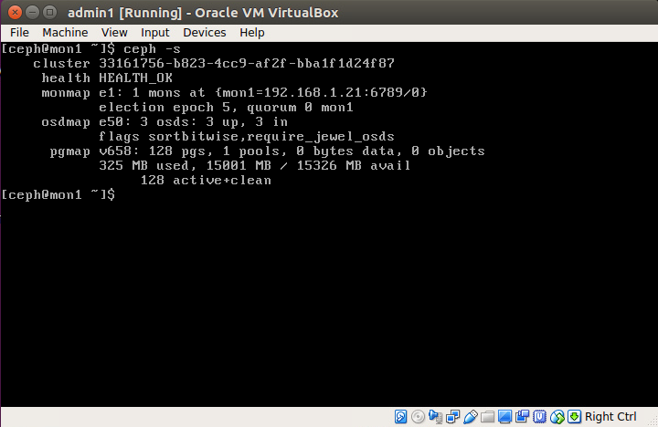
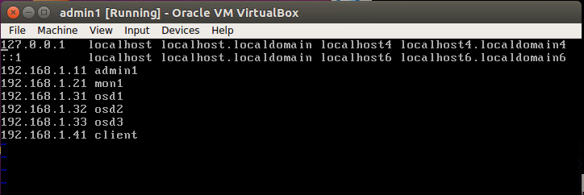
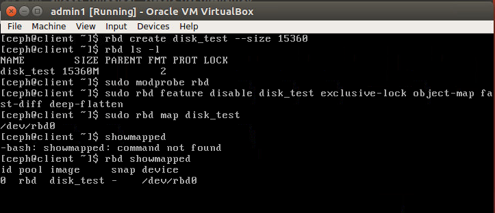
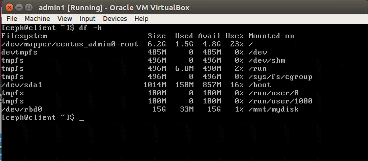
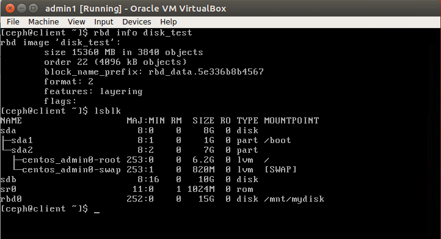
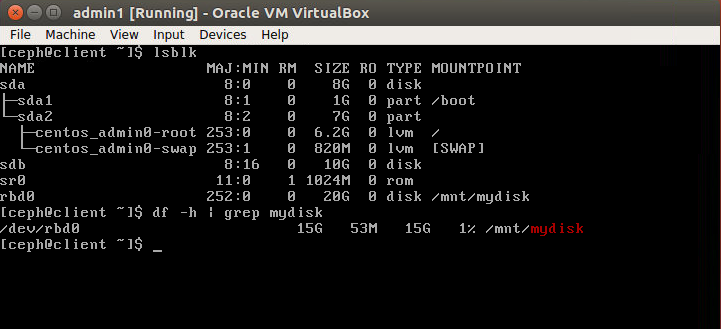
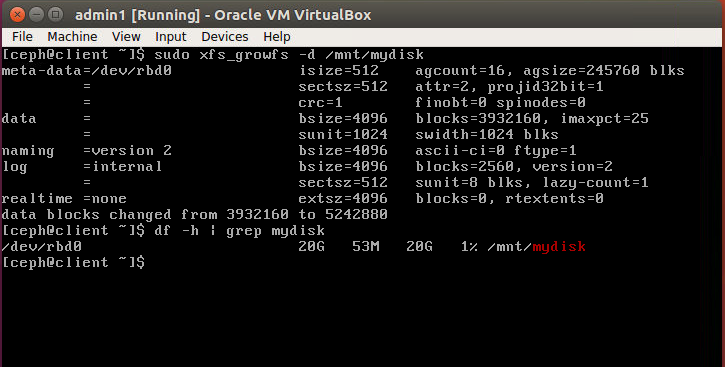

## MỤC LỤC


## NỘI DUNG

## Cài đặt và cấu hình Ceph block device client để sử dụng Ceph như một filesystem tại client

### 1. Cấu hình Ceph client node

Mô hình ceph cluster đã cài đặt:



Sử dụng thêm một máy ảo Centos 7 (có địa chỉ IP 192.168.1.41) làm node client. Từ admin node thực hiện ssh root@192.168.1.41 và cấu hình:

Cấp quyền root cho user ceph:

```
echo "ceph ALL = (root) NOPASSWD:ALL" tee /etc/sudoers.d/ceph"
chmod 644 /etc/sudoers.d/ceph
visudo 
```

thêm vào câu lệnh *Defaults:ceph !requiretty* Bên dưới Defaults

Thêm IP và tên host của client vào các file cấu hình mạng của tất cả các node.




### 2. Cấu hình Ceph admin node

Trở về admin node và tiến hành thêm cấu hình ssh vào file ~/.ssh/config

```
Host client
Hostname client
User ceph
```

Thêm admin SSH key tới node client:

```
ssh-keyscan >> ~/.ssh/known_hosts
ssh-copy-id client
```

### 3. Cài đặt ceph trên client node

Từ admin node vào thư mục my-cluster đã tạo khi cài đặt ceph cluster. Cài đặt ceph, đẩy cấu hình và admin key tới client node

```
# cài ceph cho client
ceph-deploy install client
ceph-deploy admin client
# Thay đổi quyền admin key trên client
ssh client
sudo chmod 644 /etc/ceph/ceph.client.admin.keyring
```

### 4. Cấu hình và mount ceph block device

Tiến hành ssh đến client. Ceph cung cấp các câu lệnh rbd để quản lý rados block device images. Chúng ta có thể tạo mơí, thay đổi kích thước, snapshot, export block device với các câu lệnh rbd.

Tạo mới một rbd image có kích thước là 15G

```
rbd create disk_test --size=15360
rbd ls -l
```

Kích hoạt rbd kernel module

```
sudo modprobe rbd
sudo rbd feature disable disk_test exclusive-lock object-map fast-diff deep-flatten
```

map disk_test image thông qua rbd kernel module và kiểm tra kết quả map

```
sudo rbd map disk_test
rbd showmapped
```



Đảm bảo rằng disk_test nằm trong /dev/rbd0. trước khi sử dụng để lưu dữ liệu cần format disk_test. sử dụng định dạng xfs

```
sudo mkfs.xfs /dev/rbd0
```

Tạo thư mục con mydisk trong thư mục mnt và mount /dev/rbd0 vào.

```
sudo mkdir -p /mnt/mydisk
sudo mount /dev/rbd0 /mnt/mydisk
```


Ceph block device đã được cấu hình và mount vào máy client, kiểm tra bằng lệnh

```
df -hT
```



Cấu hình để auto mount ceph block device vào hệ thống khi khởi động. Tạo một service file cho "RBD Auto Mount". Tạo một thư mục mới trong /usr/local/bin cho việc mounting and unmounting của RBD disk_test.

```
cd /usr/local/bin/
vim rbd-mount
```

Thêm vào script:

```
#!/bin/bash
# pools name
export poolname=rbd

# disk image name
export rbdimage=disk_test

# Mount Directory
export mountpoint=/mnt/mydisk

# Image mount/unmount and pool are passed from the systems service as arguments
# Determine if we are mounting or unmounting
if [ "$1" == "m" ]; then
   modprobe rbd
   rbd feature disable $rbdimage exclusive-lock object-map fast-diff deep-flatten
   rbd map $rbdimage --id admin --keyring /etc/ceph/ceph.client.admin.keyring
   mkdir -p $mountpoint
   mount /dev/rbd/$poolname/$rbdimage $mountpoint
fi
if [ "$1" == "u" ]; then
   umount $mountpoint
   rbd unmap /dev/rbd/$poolname/$rbdimage
fi
```

Thêm quyền thực thi cho file

```
chmod +x rbd-mount
```

Tạo một service file rbd-mount.service tại thư mục /etc/systemd/system có nội dung như sau:

```
[Unit]
Description=RADOS block device mapping for $rbdimage in pool $poolname"
Conflicts=shutdown.target
Wants=network-online.target
After=NetworkManager-wait-online.service
[Service]
Type=oneshot
RemainAfterExit=yes
ExecStart=/usr/local/bin/rbd-mount m
ExecStop=/usr/local/bin/rbd-mount u
[Install]
WantedBy=multi-user.target
```

reload lại systemd file và enable rbd-mount.service.

```
systemctl daemon-reload
systemclt enable rbd-mount.service
```

### Thay đổi kích thước Rados block device

Sau khi cấu hình xong Rados block device và mount vào hệ thống ta được kết quả như sau:



Tiến hành thay đổi kích thước RBD từ 15G lên 20G

```
rbd resize disk_test --size 20480
```

Kết quả:



Tuy nhiên df -h thì cho kết quả vẫn là 15G ban đầu là vì các filesystem không tự động thay đổi cấu trúc. Tiến hành format block device như sau:

```
sudo xfs_growfs -d /mnt/mydisk
df -h | grep mydisk
```

