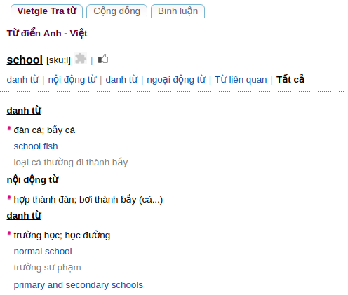
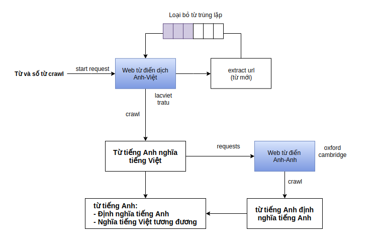

## MỤC LỤC 

## NỘI DUNG

### Kịch bản crawl dữ liệu từ vựng trên web từ điển.

Bắt đầu crawl với web từ điển dịch tiếng Anh sang tiếng Việt là web [tratu.coviet.vn](http://tratu.coviet.vn).

Tạo request với đầu vào là 1 từ tiếng Anh và số từ cần crawl. Một từ có thể vừa là danh từ, tính từ, trạng từ,... Mỗi dạng tự thì có một hoặc nhiều nghĩa và mỗi nghĩa có một hoặc nhiều ví dụ hoặc không có ví dụ.

Các url của từ mới sẽ được extract từ các ví dụ của từ trước đó và đưa vào hàng đợi. Hàng đợi sẽ loại bỏ các từ trùng lặp giữa các từ được extract và các từ đã được crawl. Tiếp tục crawl cho tới khi đạt số lượng từ mong muốn.

Sau khi crawl xong web từ điển dịch Anh việt tiến hành crawl web từ điển Anh-Anh là [https://en.oxforddictionaries.com/](https://en.oxforddictionaries.com/).

Dữ liệu sau khi được crawl sẽ được lưu dưới dạng file .csv như sau:

- Mỗi từ sẽ có 1 id duy nhất 
- Các trường như: nghĩa, từ loại(tính từ, động từ, trạng từ), ví dụ ... sẽ được lưu sang các file riêng biệt theo id của từ

Khó khăn có thể gặp phải ở đây là hàng đợi sẽ rỗng khi chưa đạt số từ mong muốn, và khi loại bỏ các từ trùng lặp sẽ dẫn đến làm chậm tốc độ crawl khi số từ crawl được lớn.